Android 推送
========================

.. highlight:: java

Android 推送分为 :ref:`小米推送<小米推送>`、 :ref:`华为推送<华为推送>` 和 :ref:`FCM 推送（原 GCM 推送）<FCM 推送>`，三种推送的接口类型标识如下：

::

    public @interface PushFactory {
    }

    /**
     * 小米推送
     */
    public static final int XIAOMI = 0;
    /**
     * 华为推送
     */
    public static final int HUAWEI = 1;
    /**
     * FCM 推送（原GCM推送）
     */
    public static final int GCM = 2;

下面将分别介绍小米推送、华为推送和 FCM 推送的集成操作。

^^^^^^^^^^^^^^^^^^^^^^^^^

.. _小米推送:

小米推送
--------------------------

小米推送（MiPush）是小米公司为开发者提供的消息推送服务。菊风云平台 利用 Mipush 确保消息及时到达。MiPush 功能包含呼叫和 IM（即时消息）的推送。呼叫是以透传的方式到达终端，终端直接显示来电界面。IM 是以通知栏的方式到达终端，在通知栏中显示推送的消息。

**小米推送集成流程**

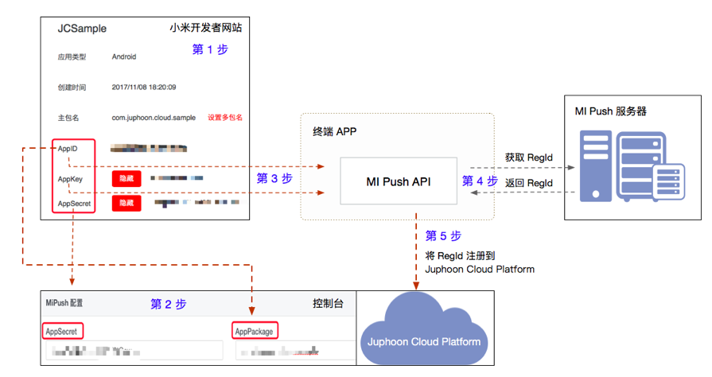

1. 在小米开发者网站注册并创建应用，获取 APPID、AppKey 和 AppSecret；

2. 在菊风控制台填入 “主包名”和 AppSecret；

3. 终端调用 MiPush 接口，使用 AppID、AppKey 这两个值向 MiPush 服务器注册服务，并获得 RegId；

4. 调用 菊风云平台 SDK 接口将 RegId 注册到 菊风云平台 服务器中。

具体如下：

配置和注册 MiPush
>>>>>>>>>>>>>>>>>>>>>>>>>>>

1. 首先在 `小米开发者网站 <https://dev.mi.com/console/>`_ 注册，并在小米推送服务创建应用，具体请参考 `小米推送服务启用指南 <https://dev.mi.com/doc/?p=1621>`_ 。

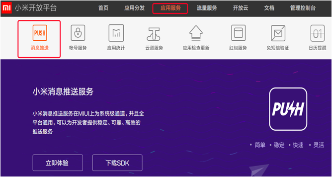

应用创建后将获得 AppID、AppKey 和 AppSecret。

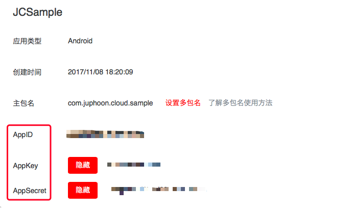

其中：AppId 和 AppKey 是客户端的身份标识，在客户端 SDK 初始化时使用；

AppSecret 是服务器端的身份标识，在使用 Server SDK 向客户端发送消息时使用。

2. 将 “主包名”、AppSecret 设置到 菊风云平台 控制台的对应应用中。

登录 菊风云平台 并打开应用，进入 设置 > 基本 > +添加push > Mipush 配置，如下图所示：

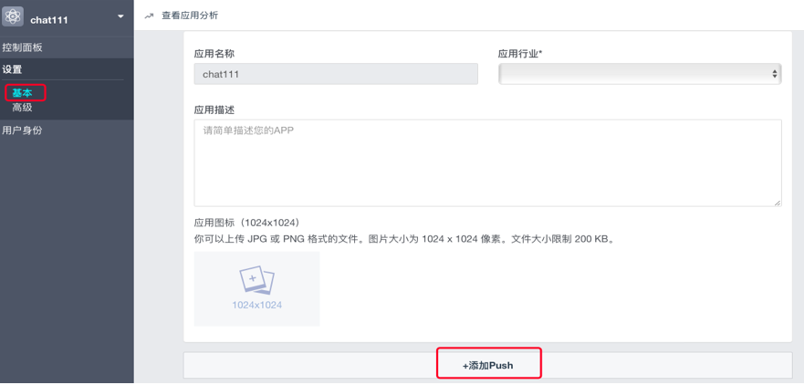

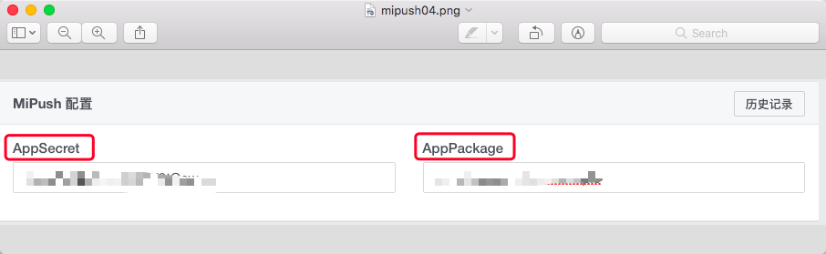

3. 获取 RegId。

终端调用 MiPush 接口，使用 AppID、AppKey 这两个值向 MiPush 服务器注册服务，并获得 RegId。具体如下：

在 JCManager 文件中，将 MIPUSH_APP_ID 和 MIPUSH_APP_KEY 替换成自己的 AppID、AppKey；

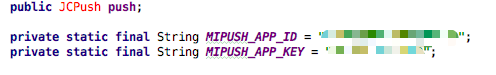

您也可以参考 `小米推送服务Android版客户端SDK使用指南 <https://dev.mi.com/doc/?p=544>`_ 。

4. 调用 菊风云平台 SDK 接口将 RegId 注册到 菊风云平台 服务器中。

代码集成
>>>>>>>>>>>>>>>>>>>>>>>>>>

**初始化 Push**
::

    /**
     * 创建 JCPush 对象
     *
     * @param client   JCClient 对象
     * @return 返回 JCPush 对象
     */
    public static JCPush create(JCClient client);

示例代码::

    JCClient client = JCClient.create(Context, "your appkey", this, null);
    JCPush push = JCPush.create(client);

**注册小米 push**

在 MiPushMessageReceiver 类中的 onReceiveRegisterResult 成功收到回调之后，调用 initWithMiPush 接口进行注册：

::

    public void onReceiveRegisterResult(Context context, MiPushCommandMessage message){
        // 向菊风平台添加推送参数
        JCPushTemplate pushInfo = new JCPushTemplate();
        pushInfo.initWithMiPush(context.getPackageName(), mRegId);
        JCManager.getInstance().push.addPushInfo(pushInfo);
        // 设置通话推送参数
        pushInfo.initWithCall(JCPushTemplate.XIAOMI, JCManager.getInstance().client.getUserId(), "呼叫", "0");
        JCManager.getInstance().push.addPushInfo(pushInfo);
        // 设置消息推送参数
        pushInfo.initWithText(JCPushTemplate.XIAOMI, JCManager.getInstance().client.getUserId(), "Text", "消息", "0");
        JCManager.getInstance().push.addPushInfo(pushInfo);
    }

其中，initWithMiPush 接口如下
::

    /**
     * 生成小米推送参数
     *
     * @param appPackage 该应用的 AppPackage 值
     * @param regId 小米推送注册成功返回的 regId
     */
    public void initWithMiPush(String appPackage, String regId);

设置推送参数接口如下：

- 通话推送参数

::

    /**
     * 生成通话推送参数
     *
     * @param pushFactory 推送厂商
     * @param selfId 自身唯一标识符
     * @param description 描述信息，如 "呼叫"
     * @param passThrough 小米推送相关参数，"1"表示透传消息，"0"表示非透传消息，可以参看小米推送文档
     */
    public void initWithCall(@PushFactory int pushFactory, String selfId, String description, String passThrough);

- 消息推送参数

::

    /**
     * 生成消息类推送参数
     *
     * @param pushFactory 推送厂商
     * @param selfId 自身唯一标识符
     * @param type 消息类型，自定义类型，如 Text
     * @param description 提示内容，针对文本消息如果要提示发送内容，则填 null，类似文件消息则要填相应的信息，例如 "发送了一段语音"
     * @param passThrough 小米推送相关参数，"1"表示透传消息，"0"表示非透传消息，可以参看小米推送文档
     */
    public void initWithText(@PushFactory int pushFactory, String selfId, String type, String description, String passThrough);

添加推送模板接口如下：
::

    /**
     * 添加推送模板，用于服务器将不同类型的推送以不同的内容格式推给客户端
     *
     * @param info 推送信息
     * @return 成功返回true，失败返回false
     */
    public abstract boolean addPushInfo(JCPushTemplate info);

.. note:: 

        在收到消息推送时，可以在 MiPushMessageReceiver 类中的 onNotificationMessageClicked、onReceivePassThroughMessage 和 onNotificationMessageArrived 中进行自定义的消息处理。
        
        其中：
        
         - onReceivePassThroughMessage 方法用来接收服务器向客户端发送的透传消息；

         - onNotificationMessageClicked 方法用来接收服务器向客户端发送的通知消息；

         - onNotificationMessageArrived 用来接收服务器发来的通知栏消息（消息到达客户端时触发，并且可以接收应用在前台时不弹出通知的通知消息）。

示例代码::

    // 接收服务器向客户端发送的透传消息
    public void onReceivePassThroughMessage(Context context, MiPushMessage message) {
            if (!TextUtils.isEmpty(message.getTopic())) {
                /** 
                 * topic 为标签，开发者可以结合自己的业务特征，给用户打上不同的标签。
                 * 消息推送时，开发者可以结合每条消息的内容和目标用户，为每条消息选择对应的标签
                 **/
                String topic = message.getTopic();
            } else if (!TextUtils.isEmpty(message.getAlias())) {
                /** 
                 * alias 为别名，可以为指定用户设置别名，然后给这个别名推送消息，效果等同于给RegId推送消息，
                 * Alias是除Regid（自动生成的）和UserAccount之外的第三个用户标识
                 **/
                String alias = message.getAlias();
            }
            String content = message.getContent();
    }

    // 接收服务器向客户端发送的通知消息
    public void onNotificationMessageClicked(Context context, MiPushMessage message) {                 
        if (!TextUtils.isEmpty(message.getTopic())) {                                                  
            String topic = message.getTopic();                                                               
        } else if (!TextUtils.isEmpty(message.getAlias())) {                                           
            String alias = message.getAlias();                                                               
        }                                                                                              
        String content = message.getContent();                                                         
    }                                                                                                  

    // 接收服务器发来的通知栏消息
    public void onNotificationMessageArrived(Context context, MiPushMessage message) {      
        if (!TextUtils.isEmpty(message.getTopic())) {                                       
            String topic = message.getTopic();                                                    
        } else if (!TextUtils.isEmpty(message.getAlias())) {                                
            String alias = message.getAlias();                                                    
        }                                                                                   
        String content = message.getContent();                                              
    }                                                                                       

验证推送
>>>>>>>>>>>>>>>>>>>>>>>>>>>

推送集成后，即可进行验证，具体如下：

1. 使用用户名登录您的 App，登录后将 App 从后台杀掉。

.. important:: 透传消息需要设置开机自启动才能拉起应用。

2. 进入 `Juphoon for developer <http://developer.juphoon.com>`_ ->控制台 ->我的应用 ->设置 ->基本 ->验证 Push

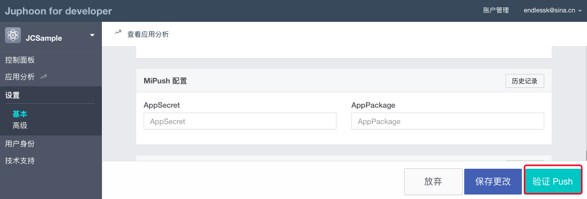

3. 输入用户名和推送内容，点击验证，此时页面应提示“push 信息发送到服务器成功”。

.. image:: images/push_prove.png

关于推送服务中常见的问题，请参考 `这里 <https://dev.mi.com/doc/?p=1608>`_ 。

^^^^^^^^^^^^^^^^^^^^^^^^^

.. _华为推送:

华为推送
--------------------------

华为推送是为开发者提供的消息推送平台，建立了从云端到手机端的消息推送通道，让应用可以将最新信息及时通知你的用户，从而构筑良好的用户关系，提升用户的活跃度。华为Push支持透传消息、通知栏消息、富媒体消息。更多信息请参考 `华为推送服务 <http://developer.huawei.com/consumer/cn/service/hms/pushservice.html>`_ 。

**华为推送工作原理**

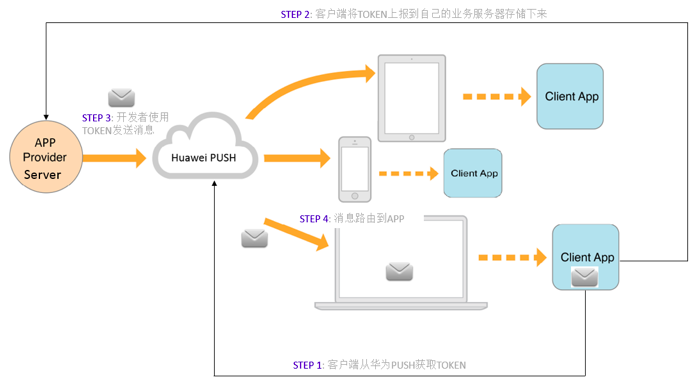

Step 1: 开发者的 App 集成华为 Push 客户端 SDK，并调用相关接口获取 PushToken； 

Step 2: 开发者的App将获取到的华为 PushToken 上报到开发者自己的服务器上； 

Step 3: 开发者利用服务器上保存的 PushToken 向设备上的 App 发送通知消息；  

Step 4: 消息携带的 PushToken 作为鉴权和路由机制会通过华为 Push 平台将消息发送到最终用户设备上。 

**华为推送集成操作流程如下：**

配置和注册华为 Push
>>>>>>>>>>>>>>>>>>>>>>>>>>>>>>>>

1. 首先在 `华为开发者网站 <http://developer.huawei.com/cn/consumer/>`_ 注册，并在华为推送服务创建应用，具体请参考 `华为推送服务接入准备 <http://developer.huawei.com/consumer/cn/service/hms/catalog/huaweipush.html?page=hmssdk_huaweipush_prepare>`_ 。

应用创建后将获得 APPID 和 APP SECRET。

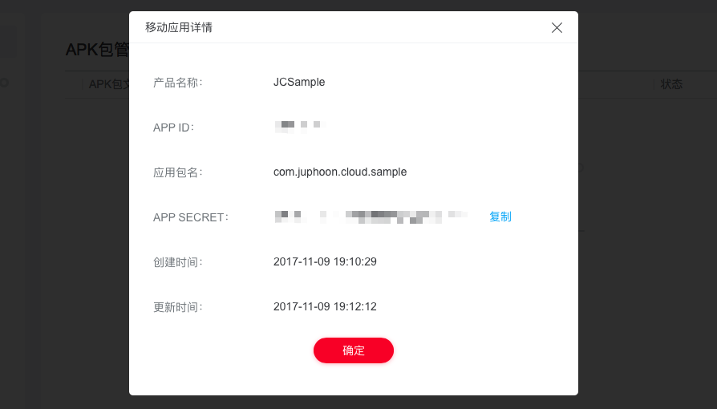

其中：APPID（全称 applicationID）是华为开发者为APP分联盟配的唯一标识。

APP SECRET 为应用秘钥，在开发 PUSH 服务端（app provider）时需要用到此参数。      

2. 将 AppID、APP SECRET 设置到 菊风云平台 控制台的对应应用中。

登录 菊风云平台 并打开应用，进入 设置 > 基本 > +添加push > HMSpush 配置，如下图所示：

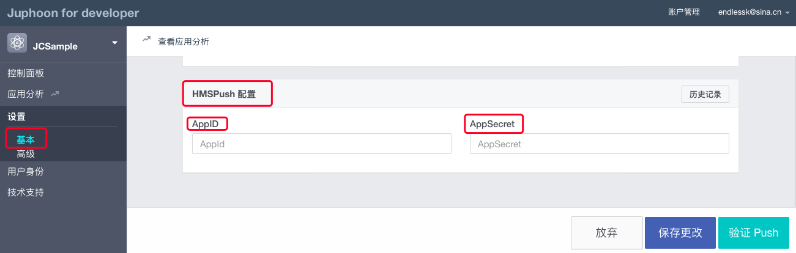

3. 获取 Token。

终端调用华为 Push 接口，使用 AppID 向华为 Push 服务器注册服务，并获得 Token。具体如下：

- 在 AndroidManifest 中将 AppID 替换成自己的 AppID 值。

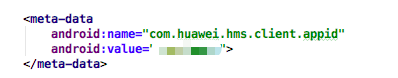

- 在 HMSPushReceiver 中将 AppID 替换成自己的 AppID 值。

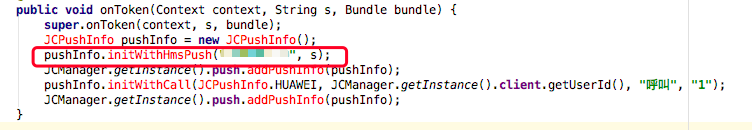

您也可以参考 `华为推送服务客户端开发指南 <http://developer.huawei.com/consumer/cn/service/hms/catalog/huaweipush.html?page=hmssdk_huaweipush_devguide>`_。

4. 调用 菊风云平台 SDK 接口将 Token 注册到 菊风云平台 服务器中。

代码集成
>>>>>>>>>>>>>>>>>>>>>>>>

**初始化 Push**
::

    /**
     * 创建 JCPush 对象
     *
     * @param client   JCClient 对象
     * @return 返回 JCPush 对象
     */
    public static JCPush create(JCClient client);

示例代码::

    JCClient client = JCClient.create(Context, "your appkey", this, null);
    JCPush push = JCPush.create(client);

**注册华为 push**

在 HMSPushReceiver 类中的 onToken 成功收到回调之后，调用 initWithHmsPush 接口进行注册：

::

    public void onToken(Context context, String s, Bundle bundle) {
        super.onToken(context, s, bundle);
        // 向菊风平台添加推送参数
        JCPushTemplate pushInfo = new JCPushTemplate();
        pushInfo.initWithHmsPush("your AppId", s);
        JCManager.getInstance().push.addPushInfo(pushInfo);
        // 设置通话推送参数
        pushInfo.initWithCall(JCPushTemplate.HUAWEI, JCManager.getInstance().client.getUserId(), "呼叫", "1");
        JCManager.getInstance().push.addPushInfo(pushInfo);
        // 设置消息推送参数
        pushInfo.initWithText(JCPushTemplate.HUAWEI, JCManager.getInstance().client.getUserId(), "Text", "消息", "1");
        JCManager.getInstance().push.addPushInfo(pushInfo);
    }

其中，initWithHmsPush 接口如下
::

    /**
     * 生成华为推送参数
     * 
     * @param appId Justalk cloud 上注册的该应用的华为Push 的 AppId 值
     * @param token 华为推送注册成功返回的 regId
     */
    public void initWithHmsPush(String AppId, String token);

设置推送参数接口如下：

- 通话推送参数

::

    /**
     * 生成通话推送参数
     *
     * @param pushFactory 推送厂商
     * @param selfId 自身唯一标识符
     * @param description 描述信息，如 "呼叫"
     * @param passThrough 华为推送相关参数，"1"表示透传消息，"0"表示非透传消息，可以参看华为推送文档，目前只支持透传消息，因华为特殊的格式，不建议使用非透传消息
     */
    public void initWithCall(@PushFactory int pushFactory, String selfId, String description, String passThrough);

- 消息推送参数

::

    /**
     * 生成消息类推送参数
     *
     * @param pushFactory 推送厂商
     * @param selfId 自身唯一标识符
     * @param type 消息类型，自定义类型，如 Text
     * @param description 提示内容，针对文本消息如果要提示发送内容，则填 null，类似文件消息则要填相应的信息，例如 "发送了一段语音"
     * @param passThrough 华为推送相关参数，"1"表示透传消息，"0"表示非透传消息，可以参看华为推送文档，目前只支持透传消息，因华为特殊的格式，不建议使用非透传消息
     */
    public void initWithText(@PushFactory int pushFactory, String selfId, String type, String description, String passThrough);

添加推送模板接口如下：
::

    /**
     * 添加推送模板，用于服务器将不同类型的推送以不同的内容格式推给客户端
     *
     * @param info 推送信息
     * @return 成功返回true，失败返回false
     */
    public abstract boolean addPushInfo(JCPushTemplate info);

.. note:: 

       在收到消息推送时，可以在 HMSPushReceiver 类中的 onPushMsg 中进行自定义的消息处理。

       由于 app 杀死以后点击 push 不会回调 onEvent（因为广播被系统限制了），所以自定义动作的处理统一用 intent 来实现。参数传递依赖 android 结构体中的intent参数。intent 中处理消息的组件只能是 activity，不能是 service 或 receiver。

示例代码::

    public void onPushMsg(Context context, byte[] bytes, String s) {
        // 收到华为 push 后续处理
        Intent intent = new Intent(JCApplication.sContext, MainActivity.class);
        intent.setFlags(Intent.FLAG_ACTIVITY_NEW_TASK);
        JCApplication.sContext.startActivity(intent);
        super.onPushMsg(context, bytes, s);
    }
    

验证推送
>>>>>>>>>>>>>>>>>>>>>>>>>>>>

推送集成后，即可进行验证，具体如下：

1. 使用用户名登录您的 App，登录后将 App 从后台杀掉。

.. important:: 透传消息需要设置开机自启动才能拉起应用。

2. 进入 `Juphoon for developer <http://developer.juphoon.com>`_ ->控制台 ->我的应用 ->设置 ->基本 ->验证 Push。

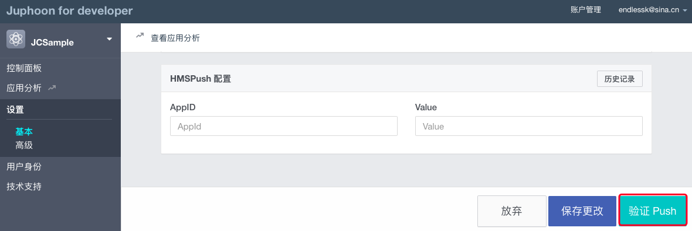

3. 输入用户名和推送内容，点击验证，此时页面应提示“push 信息发送到服务器成功”。

.. image:: images/push_prove.png

^^^^^^^^^^^^^^^^^^^^^^^^^^^^^^^^^^^^^^^^^^^^^

.. _FCM 推送:

FCM 推送
--------------------------

配置和注册 FCM Push
>>>>>>>>>>>>>>>>>>>>>>>>>>>>>>>>

1. 在 `Firebase 网站 <https://firebase.google.com/>`_ 注册并创建应用，获取服务器密钥，发送者 ID。

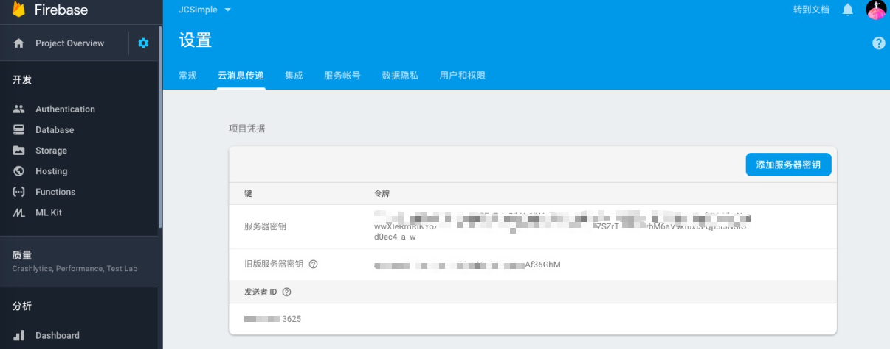

2. 在菊风控制台填入 Apikey 和 Sender（即发送者 ID）。

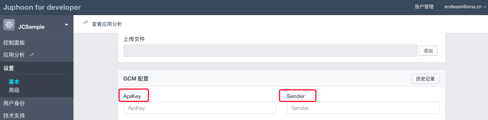

3. 终端调用 Firebase 接口 向 FireBase 服务器注册服务，并获得 Token。

::

    String refreshedToken = FirebaseInstanceId.getInstance().getToken();

4. 调用 菊风云平台 SDK 接口将 Token、发送者 ID 注册到 菊风云平台 服务器中。

更多关于 FCM 推送的信息请参考 `FireBase 官方网站 <https://firebase.google.com/docs/cloud-messaging/android/client>`_ 。

代码集成
>>>>>>>>>>>>>>>>>>>>>>>>>>>

**初始化 Push**
::

    /**
     * 创建 JCPush 对象
     *
     * @param client   JCClient 对象
     * @return 返回 JCPush 对象
     */
    public static JCPush create(JCClient client);

示例代码::

    JCClient client = JCClient.create(Context, "your appkey", this, null);
    JCPush push = JCPush.create(client);

**注册 FCM 推送**

::

    private void sendRegistrationToServer(String token) 
    {
        // 向菊风平台添加推送参数
        JCPushTemplate pushInfo = new JCPushTemplate();
        pushInfo.initWithGCM("your senderID", token);
        JCManager.getInstance().push.addPushInfo(pushInfo);
        // 设置通话推送参数
        pushInfo.initWithCall(JCPushTemplate.GCM, JCManager.getInstance().client.getUserId(), "呼叫", "1");
        JCManager.getInstance().push.addPushInfo(pushInfo);
        // 设置消息推送参数
        pushInfo.initWithText(JCPushTemplate.GCM, JCManager.getInstance().client.getUserId(), "Text", "消息", "0");
        JCManager.getInstance().push.addPushInfo(pushInfo);
    }
    
    
其中，initWithGCM 接口如下
::

    /* 生成Google推送参数
     *
     * @param senderId Justalk cloud 上注册的该应用的GCM的senderId值
     * @param token GCM注册成功返回的token
     */
    public void initWithGCM(String senderId, String token);

设置推送参数接口如下：
    
- 通话推送参数

::

    /**
     * 生成通话推送参数
     *
     * @param pushFactory 推送厂商
     * @param selfId 自身唯一标识符
     * @param description 描述信息，如 "呼叫"
     * @param passThrough Google推送相关参数，"1"表示透传消息，"0"表示非透传消息
     */
    public void initWithCall(@PushFactory int pushFactory, String selfId, String description, String passThrough);

- 消息推送参数

::

    /**
     * 生成消息类推送参数
     *
     * @param pushFactory 推送厂商
     * @param selfId 自身唯一标识符
     * @param type 消息类型
     * @param description 提示内容，针对文本消息如果要提示发送内容，则填 null，类似文件消息则要填相应的信息，例如 "发送了一段语音"
     * @param passThrough Google推送相关参数，"1"表示透传消息，"0"表示非透传消息
     */
    public void initWithText(@PushFactory int pushFactory, String selfId, String type, String description, String passThrough);

添加推送模板接口如下：

::

    /**
     * 添加推送模板，用于服务器将不同类型的推送以不同的内容格式推给客户端
     *
     * @param info 推送信息
     * @return 成功返回true，失败返回false
     */
    public abstract boolean addPushInfo(JCPushTemplate info);

验证推送
>>>>>>>>>>>>>>>>>>>>>>>>>>>>

推送集成后，即可进行验证，具体如下：

1. 使用用户名登录您的 App，登录后将 App 从后台杀掉。

2. 进入 `Juphoon for developer <http://developer.juphoon.com>`_ ->控制台 ->我的应用 ->设置 ->基本 ->验证 Push。

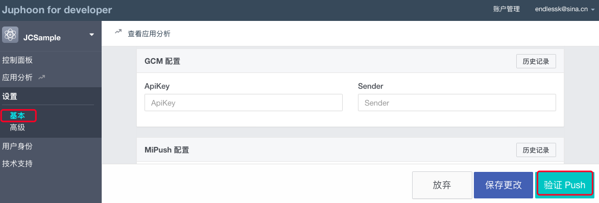

3. 输入用户名和推送内容，点击验证，此时页面应提示“push 信息发送到服务器成功”。

.. image:: images/push_prove.png