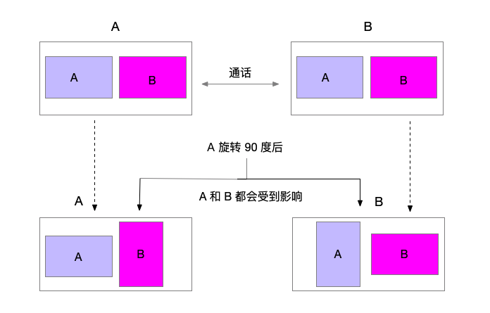

Android
===========================

.. _多方通话-Android:

.. highlight:: java

前提条件
----------------------------------

- Android SDK API 等级 16 或以上

- 支持 Android 4.1 或以上版本的移动设备

- 有效的菊风开发者账号（`免费注册 <http://developer.juphoon.com/signup>`_ ）

准备工作
----------------------------

开始之前，请您先做好如下准备工作：

SDK 下载
>>>>>>>>>>>>>>>>>>>>>>>>>>>>>>>>>>

点击 `Android SDK <http://developer.juphoon.com/document/cloud-communication-android-sdk#2>`_ 进行下载。

AppKey 获取
>>>>>>>>>>>>>>>>>>>>>>>>>>>>>>>>>>

AppKey 是应用在 菊风云平台 中的唯一标识。需要在 SDK 初始化的时候使用，AppKey 获取请参考 :ref:`创建应用 <创建应用>` 。

SDK 配置
>>>>>>>>>>>>>>>>>>>>>>>>>>>>>>>>>>

1. 下载 SDK，拷贝 libs 文件夹内的 armeabi-v7a、X86、mtc.jar 、JCSDK.jar 和 zmf.jar 到您工程目录中的 libs 目录下，并打开工程，如下图所示:

.. image:: images/android_sdklist.png

.. image:: images/quickstart_android1.png

2. 为能连接到我们的 so 库，在您工程 build.gradle 文件中确保增加以下配置，如图:

.. image:: images/set_sdk_android2.png

3. 修改您工程中 Application 配置文件 AndroidManifest.xml，**请确保已经加入以下特性和权限信息**。具体信息可以参考 :ref:`Android 权限说明<Android 权限说明>` 。
::

    <uses-feature android:name="android.hardware.camera" />
    <uses-feature android:name="android.hardware.camera.autofocus" />
    <uses-permission android:name="android.permission.INTERNET" />
    <uses-permission android:name="android.permission.ACCESS_NETWORK_STATE" />
    <uses-permission android:name="android.permission.ACCESS_WIFI_STATE" />
    <uses-permission android:name="android.permission.READ_PHONE_STATE" />
    <uses-permission android:name="android.permission.WAKE_LOCK" />
    <uses-permission android:name="android.permission.CAMERA" />
    <uses-permission android:name="android.permission.RECORD_AUDIO" />
    <uses-permission android:name="android.permission.MODIFY_AUDIO_SETTINGS" />
    <uses-permission android:name="android.permission.WRITE_EXTERNAL_STORAGE" />
    <uses-permission android:name="android.permission.VIBRATE"/>
    <uses-permission android:name="android.permission.BLUETOOTH" />
    <uses-permission android:name="android.permission.SYSTEM_ALERT_WINDOW" />

.. note::

    您在 AndroidManifest 中进行权限配置时，请确保您能够获得打开摄像头、音视频录制等相关权限。

4. 配置完成后编译运行，如果没有报错，恭喜您，您已经成功配置 SDK，可以进行 SDK 初始化了。

.. note:: SDK 不支持模拟器运行，请使用真机。

SDK 初始化
>>>>>>>>>>>>>>>>>>>>>>>>>>>>>>>>>>

.. _Android SDK 初始化:

在使用 SDK 之前，都应该首先进行 SDK 的初始化。

.. highlight:: java

初始化 SDK，具体接口如下：

::

    /**
     * 创建 JCClient 实例
     *
     * @param appKey      用户从 Juphoon Cloud 平台上申请的 AppKey 字符串
     * @param callback    回调接口，用于接收 JCClient 相关通知
     * @param extraParams 额外参数，没有则填null
     * @return JCClient 对象
     */
    public static JCClient create(Context context, String appKey, JCClientCallback callback, Map<String, String> extraParams)

.. note::

       appKey 为准备工作中“获取 AppKey”步骤中取得的 AppKey。如果还未获取 AppKey，请参考 :ref:`创建应用 <创建应用>` 来获取。

示例代码::

    public boolean initialize(Context context) {
        // 初始化各模块，因为这些模块实例将被频繁使用，建议声明在单例中
        JCClient client = JCClient.create(Context, "your appkey", this, null);
        return true;
    }

SDK 初始化之后，即可进行登录的集成。

登录
-------------------------------

.. _Android 登录:

登录涉及 JCClient 类，其主要作用是负责登录、登出管理及帐号信息存储。

.. highlight:: java

登录之前，可以通过配置关键字进行登录的相关配置，如是否使用代理服务器登录以及服务器地址的设置，具体如下：

登录环境设置
>>>>>>>>>>>>>>>>>>>>>>>>>>>>>>>>>>

服务器地址设置，包括国际环境服务器地址和国内环境服务器地址
::

    /**
     * 设置配置相关参数 
     * CONFIG_KEY_SERVER_ADDRESS, CONFIG_KEY_HTTPS_PROXY 均需要在 login 之前调用 
     *
     * @param key    参数关键字
     * @param value  参数值
     * @return 返回 true 表示设置成功，false 表示设置失败
     * @see JCClient.ConfigKey
     */
    public abstract boolean setConfig(@ConfigKey String key, String value);

其中，配置关键字有
::

    /**
     * 服务器地址
     */
    public static final String CONFIG_KEY_SERVER_ADDRESS = "config_key_server_address";
    /**
     * 设备id
     */
    public static final String CONFIG_KEY_DEVICE_ID = "config_key_device_id";
    /**
     * https代理, 例如 192.168.1.100:3128
     */
    public static final String CONFIG_KEY_HTTPS_PROXY = "config_key_https_proxy";

.. note::

    **国际环境** 服务器地址为 ``http:intl.router.justalkcloud.com:8080`` 。

    **国内环境** 服务器地址为 ``http:cn.router.justalkcloud.com:8080`` 。

示例代码::

    JJCClient client = JCClient.create(Context, "your appkey", this, null);
    // 设置登录地址（国内环境）
    client.setConfig(JCClientConfigServer, "http:cn.router.justalkcloud.com:8080");
     // 设置登录地址（国际环境）
    client.setConfig(JCClientConfigServer, "http:intl.router.justalkcloud.com:8080");

设置登录相关参数后，可以调用下面的方法获取相关的配置
::

    /**
     * 获取配置相关参数
     *
     * @param key 参数关键字
     * @return 成功返回字符串类型具体值, 失败返回 NULL
     * @see JCClient.ConfigKey
     */
    public abstract String getConfig(@ConfigKey String key);

示例代码::

    JJCClient client = JCClient.create(Context, "your appkey", this, null);
    // 获取登录配置
    client.getConfig(JCClientConfigServer);

发起登录
>>>>>>>>>>>>>>>>>>>>>>>>>>>>>>>>>>

登录参数设置之后，即可调用 login 接口发起登录操作::

    /**
     * 登录 Juphoon Cloud 平台，只有登陆成功后才能进行平台上的各种业务
     * 登录结果通过 JCCallCallback 通知 
     * 注意:用户名为英文数字和'+' '-' '_' '.'，长度不要超过64字符，'-' '_' '.'不能作为第一个字符
     *
     * @param userId    用户名
     * @param password  密码，但不能为空
     * @return 返回 true 表示正常执行调用流程，false 表示调用异常，异常错误通过 JCClientCallback 通知
     */
    public abstract boolean login(String userId, String password);

.. note:: 用户名大小写不敏感，用户名为英文、数字和'+' '-' '_' '.'，长度不要超过64字符，'-' '_' '.'不能作为第一个字符。

示例代码::

    client.login(userI, password);

登录操作执行之后，登录的结果通过 onLogin 回调接口上报
::

    /**
     * 登录结果回调
     *
     * @param result  true 表示登陆成功，false 表示登陆失败
     * @param reason  当 result 为 false 时该值有效
     */
    void onLogin(boolean result, @JCClient.ClientReason int reason);

其中，ClientReason 有
::

    /**
     * 正常
     */
    public static final int REASON_NONE = 0;
    /**
     * sdk 未初始化
     */
    public static final int REASON_SDK_NOT_INIT = 1;
    /**
     * 无效参数
     */
    public static final int REASON_INVALID_PARAM = 2;
    /**
     * 函数调用失败
     */
    public static final int REASON_CALL_FUNCTION_ERROR = 3;
    /**
     * 当前状态无法再次登录
     */
    public static final int REASON_STATE_CANNOT_LOGIN = 4;
    /**
     * 超时
     */
    public static final int REASON_TIMEOUT = 5;
    /**
     * 网络异常
     */
    public static final int REASON_NETWORK = 6;
    /**
     * appkey 错误
     */
    public static final int REASON_APPKEY = 7;
    /**
     * 账号密码错误
     */
    public static final int REASON_AUTH = 8;
    /**
     * 无该用户
     */
    public static final int REASON_NOUSER = 9;
    /**
     * 强制登出
     */
    public static final int REASON_SERVER_LOGOUT = 10;
    /**
     * 其他错误
     */
    public static final int REASON_OTHER = 100;

登录成功之后，SDK 会自动保持与服务器的连接状态，直到用户主动调用登出接口，或者因为帐号在其他设备登录导致该设备登出。

登出
>>>>>>>>>>>>>>>>>>>>>>>>>>>>>>>>>>

登出调用下面的方法，登出后不能进行平台上的各种业务操作
::

    /**
     * 登出 Juphoon Cloud 平台，登出后不能进行平台上的各种业务
     *
     * @return 返回 true 表示正常执行调用流程，false 表示调用异常，异常错误通过 JCClientCallback 通知
     */
    public abstract boolean logout();

登出结果通过 onLogout 回调接口上报::

    /**
     * 登出回调
     *
     * @param reason 登出原因
     */
    void onLogout(@JCClient.ClientReason int reason);

当登录状态发生改变时，会收到 onClientStateChange 回调
::

    /**
     * 登录状态变化通知
     *
     * @param state    当前状态值
     * @param oldState 之前状态值
     */
    void onClientStateChange(@JCClient.ClientState int state, @JCClient.ClientState int oldState);

ClientState 有::

    // 未初始化
    public static final int STATE_NOT_INIT = 0;
    // 未登录
    public static final int STATE_IDLE = 1;
    // 登录中
    public static final int STATE_LOGINING = 2;
    // 登录成功
    public static final int STATE_LOGINED = 3;
    // 登出中
    public static final int STATE_LOGOUTING = 4;

示例代码::

    public void onClientStateChange(@JCClient.ClientState int state, @JCClient.ClientState int oldState) {
         if (state == JCClient.STATE_IDLE) { // 未登录
           ...
        } else if (state == JCClient.STATE_LOGINING) { // 正在登录
           ...
        } else if (state == JCClient.STATE_LOGINED) { // 登录成功
           ... 
        } else if (state == JCClient.STATE_LOGOUTING) { // 登出中
           ...
        }
    }

集成登录后，即可进行相关业务的集成。

``SDK 支持前后台模式，可以在应用进入前台或者后台时调用 JCClient 类中的 setForeground 方法进行设置``

::

    /**
     * 设置是否为前台, 在有控制后台网络的手机上当进入前台时主动触发
     *
     * @param foreground 是否为前台
     */
    public abstract void setForeground(boolean foreground);

^^^^^^^^^^^^^^^^^^^^^^^^^^^^^^^

完成以上步骤，就做好了基础工作，您可以开始集成业务了。

业务集成
----------------------------------

**相关类说明**

多方视频通话涉及以下类：

.. list-table::
   :header-rows: 1

   * - 名称
     - 描述
   * - `JCMediaChannel <http://developer.juphoon.com/portal/reference/android/com/juphoon/cloud/JCMediaChannel.html>`_
     - 媒体频道模块，类似音视频房间的概念，可以通过频道号加入此频道，从而进行音视频通话
   * - `JCMediaChannelParticipant <http://developer.juphoon.com/portal/reference/android/com/juphoon/cloud/JCMediaChannelParticipant.html>`_
     - 媒体频道成员，主要用于成员基本信息以及状态等的管理
   * - `JCMediaChannelQueryInfo <http://developer.juphoon.com/portal/reference/android/com/juphoon/cloud/JCMediaChannelQueryInfo.html>`_
     - 媒体频道查询信息结果
   * - `JCMediaChannelCallback <http://developer.juphoon.com/portal/reference/android/com/juphoon/cloud/JCMediaChannelCallback.html>`_
     - 媒体频道模块回调代理
   * - `JCMediaDevice <http://developer.juphoon.com/portal/reference/android/com/juphoon/cloud/JCMediaDevice.html>`_
     - 设备模块，主要用于视频、音频设备的管理
   * - `JCMediaDeviceVideoCanvas <http://developer.juphoon.com/portal/reference/android/com/juphoon/cloud/JCMediaDeviceVideoCanvas.html>`_
     - 视频对象，主要用于 UI 层视频显示、渲染的控制
   * - `JCMediaDeviceCallback <http://developer.juphoon.com/portal/reference/android/com/juphoon/cloud/JCMediaDeviceCallback.html>`_
     - 设备模块回调代理

更多关于类的详细信息请参考 `API 说明文档 <http://developer.juphoon.com/portal/reference/android/>`_ 。

**开始集成多方通话功能前，请先进行** ``模块的初始化``

创建 JCMediaChannel 实例
::
    
    /**
     * 创建 JCMediaChannel 对象
     *
     * @param client      JCClient 对象
     * @param mediaDevice JCMediaDevice 对象
     * @param callback    JCMediaChannelCallback 回调接口，用于接收 JCMediaChannel 相关通知
     * @return            返回 JCMediaChannel 对象
     */
    public static JCMediaChannel create(JCClient client, JCMediaDevice mediaDevice, JCMediaChannelCallback callback);

创建 JCMediaDevice 实例
::

    /**
     * 创建 JCMediaDevice 对象
     *
     * @param client   JCClient 对象
     * @param callback JCMediaDeviceCallback 回调接口，用于接收 JCMediaDevice 相关通知
     * @return 返回 JCMediaDevice 对象
     */
    public static JCMediaDevice create(JCClient client, JCMediaDeviceCallback callback)

示例代码
::

    // 初始化各模块，因为这些模块实例将被频繁使用，建议声明在单例中
    JCMediaDevice mediaDevice = JCMediaDevice.create(client, this);
    JCMediaChannel mediaChannel = JCMediaChannel.create(client, mediaDevice, this);

**开始集成**

1. 加入频道
>>>>>>>>>>>>>>>>>>>>>>>>>>>>>>>>>>

.. image:: multivideocall.png

频道设置
^^^^^^^^^^^^^^^^^^^^^^^^^^^^^^^^^^^^^^^^^

加入频道之前可以调用下面的接口进行频道设置，通过配置关键字对频道进行设置，如频道允许加入的最大人数，sip 呼叫配置。
::

    /**
     * 设置相关配置参数
     *
     * @param key   配置关键字
     * @param value 参数值
     * @return      返回 true 表示设置成功，false 表示设置失败
     * @see ConfigKey
     */
    public abstract boolean setConfig(@ConfigKey String key, String value);

具体配置参数关键字如下

.. list-table::
   :header-rows: 1

   * - 名称
     - 描述
   * - CONFIG_CAPACITY = "config_capacity";
     - 设置频道人数
   * - CONFIG_SIP_CALLER_NUMBER = "config_sip_caller_number";
     - 设置 SIP呼叫 主叫号码
   * - CONFIG_SIP_CORE_NETWORK = "config_sip_core_network";
     - 设置 SIP呼叫 核心网ID

频道设置后，可以通过下面的接口获取配置参数
::

    /**
     * 获取相关配置参数
     *
     * @param   key 配置关键字, 参见 JCMediaChannelConstants
     * @return  成功返回字符串类型具体值, 失败返回 NULL
     * @see ConfigKey
     */
    public abstract String getConfig(@ConfigKey String key);

发送本地音频流
^^^^^^^^^^^^^^^^^^^^^^^^^^^^^^^^^^^^^^^^^

在加入频道时，SDK 会 **自动打开音频设备**，因此可以在加入频道之前直接调用 enableUploadAudioStream 方法打开或关闭“上传音频”的标识，这样加入频道后其他成员就可以听到您的声音
::

    /**
     * 开启关闭发送本地音频流
     * 1.在频道中将会与服务器进行交互，服务器会更新状态并同步给其他用户
     * 2.未在频道中则标记是否上传音频流，在join时生效
     * 3.建议每次join前设置
     *
     * @param enable 是否开启本地音频流
     * @return 返回 true 表示正常执行调用流程，false 表示调用异常
     */
    public abstract boolean enableUploadAudioStream(boolean enable);

.. note:: 

        在多方通话中，enableUploadAudioStream 的作用是设置“是否发送音频流数据”，此方法可以在加入频道前调用，也可以在加入频道后调用。
         - 如果在加入频道前调用，**只是打开或关闭“上传音频”的标识，但不会发送数据**，当加入频道成功时会根据 enableUploadAudioStream 设定的值来确定是否上传音频数据。同时，频道中的其他成员会收到该成员“是否上传音频“的状态变化回调（onParticipantUpdate）。
         - 如果在加入频道后调用，则会开启或者关闭发送本地音频流数据，服务器也会根据 enableUploadAudioStream 设定的值来确定是否上传音频数据。同时，频道中的其他成员会收到该成员“是否上传音频“的状态变化回调（onParticipantUpdate）。
        此外，此方法还可以实现开启或关闭静音的功能。当 enable 值为 false ，将会停止发送本地音频流，此时其他成员将听不到您的声音，从而实现静音功能

发送本地视频流
^^^^^^^^^^^^^^^^^^^^^^^^^^^^^^^^^^^^^^^^^

在加入频道前可以调用下面的方法打开或关闭“上传视频流”的标识，如果想看到视频画面，需要在加入频道后手动调用打开摄像头的接口
::

    /**
     * 开启关闭发送本地视频流
     * 1.在会议中将会与服务器进行交互，服务器会更新状态并同步给其他用户
     * 2.未在频道中则标记是否上传视频流，在join时生效
     * 3.建议每次join前设置
     *
     * @param enable 是否开启本地视频流
     * @return 返回 true 表示正常执行调用流程，false 表示调用异常
     */
    public abstract boolean enableUploadVideoStream(boolean enable);

.. note:: 

    在多方通话中，enableUploadVideoStream 的作用是设置“是否上传视频流数据”，可以在加入频道前调用，也可以在加入频道后调用；
     - 如果在加入频道前调用，**只是打开或关闭“上传视频流”的标识，但不发送数据**，当加入频道后会根据 enableUploadVideoStream 设定的值来确定是否上传视频流数据。同时，频道中的其他成员会收到该成员”是否上传视频“的状态变化回调（onParticipantUpdate）。如果设定的值为 false，则在加入频道后自动开启语音通话模式。
     - 如果在加入频道后调用，则会开启或关闭发送本地视频流数据。服务器会根据 enableUploadVideoStream 设定的值来确定是否上传视频流数据。同时，频道中的其他成员会收到该成员”是否上传视频“的状态变化回调（onParticipantUpdate），从而进行语音通话和视频通话的切换。
    此外，调用该方法发送本地视频流数据还要依赖摄像头是否已经打开。

加入频道
^^^^^^^^^^^^^^^^^^^^^^^^^^^^^^^^^^^^^^^^^

接口如下，参数描述请看接口注释
::

    /**
     * 加入频道
     *
     * @param channelIdOrUri  媒体频道标识或者频道Uri，当 params 中 JOIN_PARAM_URI_MODE 设置为 true 时表示频道 Uri，其他表示频道标识
     * @param params          参数，KEY值参考JoinParam，没有则填null
     * @return                返回 true 表示正常执行调用流程，false 表示调用异常
     * @see MaxResolution
     * @see JoinParam
     */
    public abstract boolean join(String channelIdOrUri, Map<String, String> params);

其中，params 类型为字典，字典中的 key 值参考下面表格中的内容：

.. list-table::
   :header-rows: 1

   * - 名称
     - 描述
   * - JOIN_PARAM_CDN = "cdn"
     - CDN 地址参数
   * - JOIN_PARAM_RECORD = "record"
     - 音视频录制参数，包括"BucketName", "SecretKey","AccessKey"和"FileKey",参数值通过在七牛云注册获得
   * - JOIN_PARAM_PASSWORD = "password"
     - 频道密码
   * - JOIN_PARAM_MAX_RESOLUTION = "maxResolution"
     - 最大分辨率，参考 JCMediaChannelMaxResolution 枚举值，默认值为 JCMediaChannelMaxResolution360
   * - JOIN_SMOOTH_MODE= "smoothMode"
     - 设置平滑模式，确保弱网环境下视频流畅，默认值为 ''true'
   * - JOIN_PARAM_URI_MODE = "uriMode"
     - 是否以会议uri方式加入，值为 'true' 'false'，默认值为 'false'
   * - JOIN_PARAM_HEARTBEAT_TIME = "HeartbeatTime"
     - 心跳时长，单位为秒，指每隔多少时间发送心跳包，是会议终端和服务端keep alive的一种方式，定时向对端发送和回馈心跳包
   * - JOIN_PARAM_HEARTBEAT_TIMEOUT = "HeartbeatTimeout"
     - 心跳超时，指多少时间内没收到心跳包就超时（认为对方已离开）
   * - JOIN_PARAM_IS_SQUARE = "IsSquare"
     - true 表示正方形画面 false 表示 16:9画面，默认值为 'false'
   * - JOIN_PARAM_FRAME_RATE = "FrameRate"
     - 帧率 1-30, 默认 24
   * - JOIN_PARAM_MAX_BITRATE = "MaxBitrate"
     - 最大码率，默认2000
   * - JOIN_PARAM_CUSTOM_PROPERTY = "CustomProperty"
     - 自定义属性, json 格式字符串

.. note:: 加入频道会自动打开音频设备。

**示例代码**

::

    // 设置频道人数
    mediaChannel.setConfig(JCMediaChannel.CONFIG_CAPACITY, "6");
    // 发送本地音频流
    mediaChannel.enableUploadAudioStream(true);
    // 发送本地视频流
    mediaChannel.enableUploadVideoStream(true);
    // 加入频道
    mediaChannel.join("channelId", null);

加入频道结果回调
::

    /**
     * 加入频道结果回调
     *
     * @param result    true 表示成功，false 表示失败
     * @param reason    加入失败原因，当 result 为 false 时该值有效
     * @param channelId 频道标识符
     */
    void onJoin(boolean result, @JCMediaChannel.MediaChannelReason int reason, String channelId);

示例代码::

    // 加入频道结果回调
    public void onJoin(boolean result, @JCMediaChannel.MediaChannelReason int reason, String channelId) {
        if (result) {
            // 加入频道成功
        } else {
            // 加入频道失败
        }
    }

创建本地视频画面
^^^^^^^^^^^^^^^^^^^^^^^^^^^^^^^^^^^^^^^^^

- :ref:`创建本地视频画面<创建本地视频画面(android)>`

加入频道后，如果想看到本地视频画面，需要打开摄像头以创建视频画面。

创建视频画面需要用到 :ref:`JCMediaDevice<JCMediaDevice(android)>` 类和 :ref:`JCMediaDeviceVideoCanvas<JCMediaDeviceVideoCanvas(android)>` 类。

本地视频渲染调用 :ref:`startCameraVideo<创建本地视频画面(android)>` 接口，**该接口会打开摄像头**

::

    /**
     * 获得视频预览对象，通过此对象能获得视频用于UI显示
     *
     * @param renderType    渲染模式
     * @return              JCMediaDeviceVideoCanvas 对象
     * @see RenderType
     */
    public abstract JCMediaDeviceVideoCanvas startCameraVideo(@RenderType int renderType);

其中，渲染模式（JCMediaDeviceRender)有以下几种::

    /**
     * 铺满窗口
     */
    public static final int RENDER_FULL_SCREEN = 0;
    /**
     * 全图像显示，会有黑边
     */
    public static final int RENDER_FULL_CONTENT = 1;
    /**
     * 自适应
     */
    public static final int RENDER_FULL_AUTO = 2;

.. note:: 调用该方法后，在挂断通话或者关闭摄像头时需要对应调用 stopVideo 方法停止视频。

示例代码::

    // 创建本地视频画面对象
    JCMediaDeviceVideoCanvas localCanvas = mediaDevice.startCameraVideo(JCMediaDevice.RENDER_FULL_CONTENT);
    viewGroup.addView(localCanvas.getVideoView(), 0);

该方法采集分辨率默认值为 640*360，帧率为 30，画面与窗口旋转角度为 0。默认打开的是前置摄像头。

如果想自定义摄像头采集参数，如采集的高度、宽度和帧速率，需要在调用 startCameraVideo 接口前调用下面的接口
::

    /**
     * 设置摄像头采集属性
     *
     * @param width     采集宽度，默认640
     * @param height    采集高度，默认360
     * @param frameRate 采集帧速率，默认30
     */
    public abstract void setCameraProperty(int width, int height, int frameRate);

如果想指定开启前置或后置摄像头，需要在调用 startCameraVideo 接口前调用下面的接口

首先获取摄像头列表
::

    /**
     * 获取摄像头列表
     *
     * @return 摄像头列表
     */
    public abstract List<String> getCameras();

camera 类型的值为下面几个常量::

    // 未获取到摄像头
    public static final int CAMERA_NONE = 0;
    // 前置摄像头
    public static final int CAMERA_FRONT = 1;
    // 后置摄像头
    public static final int CAMERA_BACK = 2;
    // 未知摄像头
    public static final int CAMERA_UNKNOWN = 3;

然后获取摄像头类型的索引
::

    /**
     * 获得摄像头类型
     *
     * @param cameraIndex 摄像头队列索引
     * @return 摄像头类型
     */
    @CameraType
    public abstract int getCameraType(int cameraIndex);

最后调用下面的方法设置要开启的摄像头
::

    /**
     * 指定要开启的摄像头
     * @param cameraIndex   摄像头索引
     */
    public abstract void specifyCamera(int cameraIndex);

如果想设置视频窗体与屏幕正方向的角度，需要在调用 startCameraVideo 接口前，调用下面的接口
::

    /**
     * 设置视频窗体角度
     *
     * @param angle 参看 @VideoAngle
     */
    public abstract void setlVideoAngle(@VideoAngle int angle);

videoAngle 设置之后，本端显示的远端视频画面会旋转设定的角度，同时对端显示的本地视频画面也会旋转设定的角度。

例如 A 设置旋转 90 度，则 B 看到的 A 的视频画面与屏幕正方向夹角为90度。 A 看到的 B 的视频画面与屏幕正方向夹角也为90度。如下图所示：

VideoAngle 枚举值有
::

    /** 自动 */
    public static final int VIDEO_ANGLE_AUTO = -1;
    /** 0度 */
    public static final int VIDEO_ANGLE_0 = 0;
    /** 90度 */
    public static final int VIDEO_ANGLE_90 = 90;
    /** 180度 */
    public static final int VIDEO_ANGLE_180 = 180;
    /** 270度 */
    public static final int VIDEO_ANGLE_270 = 270;

如果想设置Canvas中画布的角度，需要调用 JCMediaDeviceVideoCanvas 类中的 rotate 接口
::

    /**
     * 旋转角度，必须是90的倍数，该角度表示与屏幕正方向旋转后的夹角
     *
     * @param angle 角度值
     */
    public void rotate(int angle)

其中，角度需为 90 的倍数。调用该接口后，本端显示的本地视频画面和远端视频画面会同时旋转相同的角度，而对端显示的画面不受影响。

例如 A 设置旋转 90 度，则 A 端显示的 A 和 B 视频画面会同时旋转 90 度。而 B 端的视频画面则不会发生任何改变。如下图所示：

.. image:: images/rotateset.png

示例代码::

    // 获得摄像头类型
    mediaDevice.getCameraType(0);
    // 指定要开启的摄像头
    mediaDevice.specifyCamera(0);
    // 设置摄像头采集属性
    mediaDevice.setCameraResolution(640, 360, 30);
    // 设置视频窗体角度
    mediaDevice.setlVideoAngle(0);

创建远端视频画面
^^^^^^^^^^^^^^^^^^^^^^^^^^^^^^^^^^^^^^^^^

- :ref:`创建远端视频画面<创建远端视频画面(android)>`

加入频道后，如果想看到其他成员的视频画面，需要创建远端视频画面，具体如下：

- 远端视频渲染

远端视频渲染调用 :ref:`startVideo<创建远端视频画面(android)>` 接口获取视频对象
::

    /**
     * 获得视频对象，通过此对象能获得视频用于UI显示
     *
     * @param videoSource   渲染标识串，比如 JCMediaChannelParticipant JCCallItem 中的 renderId
     * @param renderType    渲染模式
     * @return              JCMediaDeviceVideoCanvas 对象
     * @see RenderType
     */
    public abstract JCMediaDeviceVideoCanvas startVideo(String videoSource, @RenderType int renderType);

其中，渲染模式（JCMediaDeviceRender)有以下几种::

    /**
     * 铺满窗口
     */
    public static final int RENDER_FULL_SCREEN = 0;
    /**
     * 全图像显示，会有黑边
     */
    public static final int RENDER_FULL_CONTENT = 1;
    /**
     * 自适应
     */
    public static final int RENDER_FULL_AUTO = 2;

.. note:: 调用该方法后，在挂断通话或者关闭摄像头时需要对应调用 stopVideo 方法停止视频。

- 请求远端成员视频流

由于服务器默认是不转发视频数据的，所以如果想看到远端成员画面需要请求远端成员的视频流
::
   
    /**
     * 请求频道中其他用户的视频流
     * 当 pictureSize 为 JCMediaChannelPictureSizeNone 时表示关闭请求
     *
     * @param participant   频道中其他成员对象
     * @param pictureSize   视频请求的尺寸类型
     * @return              返回 true 表示正常执行调用流程，false 表示调用异常
     * @see JCMediaChannel.PictureSize
     */
    public abstract boolean requestVideo(JCMediaChannelParticipant participant, @PictureSize int pictureSize);

其中，视频尺寸（JCMediaChannelPictureSize）有以下几种：

.. list-table::
   :header-rows: 1

   * - 名称
     - 描述
   * - public static final int PICTURESIZE_NONE = 0
     - 不请求
   * - public static final int PICTURESIZE_MIN = 1
     - 最小尺寸，160x90
   * - public static final int PICTURESIZE_SMALL = 2
     - 小尺寸，320x180，小窗口模式下可以使用小尺寸
   * - public static final int PICTURESIZE_LARGE = 3
     - 大尺寸，640x360
   * - public static final int PICTURESIZE_MAX = 4
     - 最大尺寸，360P 的会议为 640x360 ，720P 的会议为 1280x720

.. note:: 您可以根据相应的窗口大小使用相应的视频尺寸，避免造成不必要的流量浪费和额外的功耗。比如窗口的大小是 160x90，则应该使用 JCMediaChannelPictureSizeMin。

现在您可以开始多方视频通话了。

**示例代码**

::

    public void onParticipantJoin(JCMediaChannelParticipant participant) {
        // 创建远端视频画面对象，renderId来源JCMediaChannelParticipant对象
        List<JCMediaChannelParticipant> partps = mediaChannel.getParticipants();
        JCMediaChannelParticipant item = partps.get(0);
        String renderId = item.getRenderId();
        JCMediaDeviceVideoCanvas remoteCanvas = mediaDevice.startVideo(renderId, JCMediaDevice.RENDER_FULL_CONTENT);
        viewGroup.addView(remoteCanvas.getVideoView(), 0);
        // 请求远端视频流，participant为JCMediaChannelParticipant对象
        mediaChannel.requestVideo(participant, JCMediaChannel.PICTURESIZE_LARGE);
    }

^^^^^^^^^^^^^^^^^^^^^^^^^^^^^^^^^^^^^^^^^^

2. 离开频道
>>>>>>>>>>>>>>>>>>>>>>>>>>>>>>>>>>>>>>

.. image:: leavechannel.png

如果想离开频道，可以调用下面的接口
::

    /**
     * 离开频道
     *
     * @return 返回 true 表示正常执行调用流程，false 表示调用异常
     */
    public abstract boolean leave();

示例代码::

    // 离开频道
    mediaChannel.leave();

在多方视频通话中，离开频道后还需要调用 :ref:`stopVideo<销毁本地和远端视频画面(android)>` 接口移除视频画面
::

    /**
     * 停止视频
     *
     * @param canvas JCMediaDeviceVideoCanvas 对象，由 startVideo 获得
     */
    public abstract void stopVideo(JCMediaDeviceVideoCanvas canvas);

离开频道后，UI 会收到 onLeave 回调，该回调返回离开原因以及频道标识符
::

    /**
     * 离开频道结果回调
     *
     * @param reason    离开原因
     * @param channelId 频道标识符
     */
    void onLeave(@JCMediaChannel.MediaChannelReason int reason, String channelId);

离开原因枚举值请参考 `JCMediaChannelReason <http://developer.juphoon.com/portal/reference/android/>`_。

示例代码::

    // 离开频道结果回调
    public void onLeave(@JCMediaChannel.MediaChannelReason int reason, String channelId) {
        // 销毁视频
        JCManager.getInstance().mediaDevice.stopVideo(canvas);
        constraintLayout.removeView(canvas.getVideoView());
        canvas = null;
    }

3. 解散频道
>>>>>>>>>>>>>>>>>>>>>>>>>>>>>>>>>>>>>>

.. image:: stopchannel.png

如果想解散频道，可以调用下面的接口，此时所有成员都将被退出
::

    /**
     * 关闭频道，所有成员都将被退出
     *
     * @return 返回 true 表示正常执行调用流程，false 表示调用异常
     */
    public abstract boolean stop();

示例代码::

    // 结束频道
    mediaChannel.stop();

关闭频道的结果通过 onStop 回调
::

    /**
     * 解散频道结果回调
     *
     * @param result    true 表示成功，false 表示失败
     * @param reason    解散失败原因，当 result 为 false 时该值有效
     */
    void onStop(boolean result, @JCMediaChannel.MediaChannelReason int reason);

解散失败原因枚举值请参考 `JCMediaChannelReason <http://developer.juphoon.com/portal/reference/android/>`_。

示例代码::

    // 离开频道结果回调
    public void onStop(boolean result, @JCMediaChannel.MediaChannelReason int reason) {
        // 销毁视频
        JCManager.getInstance().mediaDevice.stopVideo(canvas);
        constraintLayout.removeView(canvas.getVideoView());
        canvas = null;
    }

Sample 代码
>>>>>>>>>>>>>>>>>>>>>>>>>>>>>>>>>>>>>>>>>>>>

**关键代码实现：**

1.初始化 JC SDK 以及频道和媒体设备模块

::

    public void initialize() 
    {
        // AppKey为创建应用获取的AppKey
        JCClient client = JCClient.create(context, "AppKey", this, null);
        JCMediaDevice mediaDevice = JCMediaDevice.create(client, this);
        JCMediaChannel mediaChannel = JCMediaChannel.create(client, mediaDevice, this);
    }

2.登录

::

    public void login()
    {
        client.login("用户名", "密码");
    }

3.频道设置

::

    // 设置会议人数，如果不设置，则默认为6人
    mediaChannel.setConfig(JCMediaChannel.CONFIG_CAPACITY, "8");

4.发送本地音视频流

::

    // 发送本地音频流
    mediaChannel.enableUploadAudioStream(true);
    // 发送本地视频流
    mediaChannel.enableUploadVideoStream(true);

5.加入频道

::

    // 加入频道
    mediaChannel.join("频道id", null);

6.本地视图渲染

::

    public void setLocalCanvas()
    {
        // 创建本地视图Canvas对象
        JCMediaDeviceVideoCanvas localCanvas = mediaDevice.startCameraVideo(JCMediaDevice.RENDER_FULL_CONTENT);
    }

7.远端视图渲染

::

    public void onParticipantJoin(JCMediaChannelParticipant participant) {
        // 创建远端视频画面对象，renderId来源JCMediaChannelParticipant对象
        JCMediaDeviceVideoCanvas remoteCanvas = mediaDevice.startVideo(renderId, JCMediaDevice.RENDER_FULL_CONTENT);
        // 请求远端视频流，participant为JCMediaChannelParticipant对象
        mediaChannel.requestVideo(participant, JCMediaChannel.PICTURESIZE_LARGE);
    }

8.离开频道

::

    // 离开频道
    mediaChannel.leave();
    // canvas为JCMediaDeviceVideoCanvas对象
    mediaDevice.stopVideo(canvas);

9.解散频道

::

    mediaChannel.stop();

**更多功能**

- :ref:`通话状态更新<通话状态更新(android)>`

- :ref:`通话过程控制<通话过程控制(android)>`

- :ref:`视频管理<视频设备管理(Android)>`

- :ref:`音频管理<设备控制(android)>`

**进阶**

在实现音视频通话的过程中，您可能还需要添加以下功能来增强您的应用：

- :ref:`查询频道<查询频道(android)>`
- :ref:`屏幕共享<屏幕共享(android)>`
- :ref:`CDN 推流<CDN 推流(android)>`
- :ref:`音视频录制<音视频录制(android)>`
- :ref:`发送消息<发送消息(android)>`

