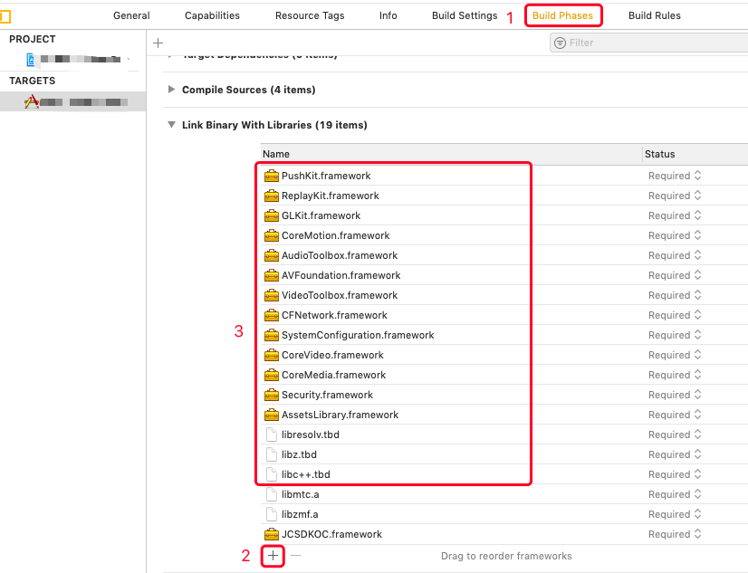
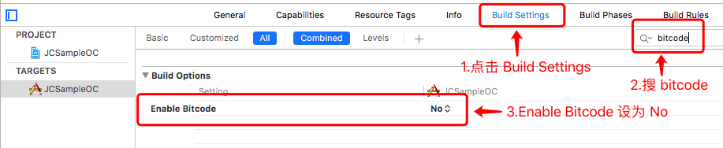
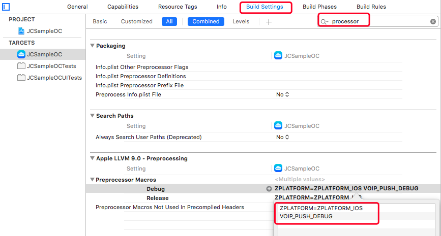
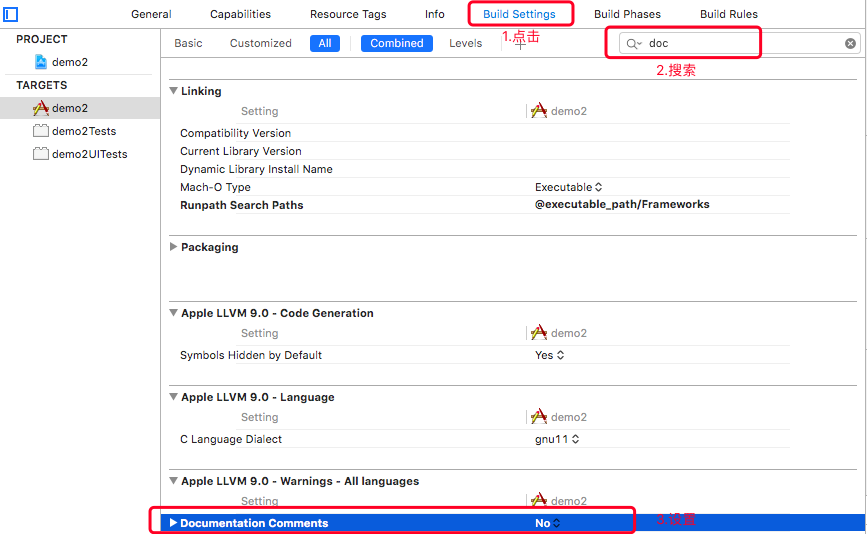
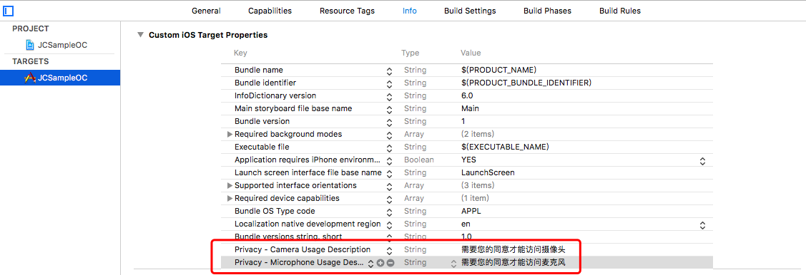

iOS
===============================

前提条件
----------------------------------

- 支持 iOS 8.0 或以上版本的 iOS **真机** 设备

- 有效的菊风开发者账号（`免费注册 <http://developer.juphoon.com/signup>`_ ）

准备工作
----------------------------------

开始之前，请先做好如下准备工作：

SDK 下载
>>>>>>>>>>>>>>>>>>>>>>>>>>>>>>>>>>

点击 `iOS SDK <http://developer.juphoon.com/document/cloud-communication-ios-sdk#2>`_ 进行下载。如果已经下载了 SDK，请直接进行 SDK 配置。

AppKey 获取
>>>>>>>>>>>>>>>>>>>>>>>>>>>>>>>>>>

AppKey 是应用在 菊风云平台 中的唯一标识。需要在 SDK 初始化的时候使用，AppKey 获取请参考 :ref:`创建应用 <创建应用>` 。

SDK 配置
>>>>>>>>>>>>>>>>>>>>>>>>>>>>>>>>>>

您可以在工程中使用静态库或者动态库，此处介绍使用静态库的配置方法。如果想使用动态库，请参考动态库的配置说明文档 :ref:`iOS 导入动态库<iOS 导入动态库>` 。

.. note::

        如果您已经集成了多家音视频引擎，则推荐使用动态库。

只有完成 SDK 的配置之后，您才可以集成 JC SDK 提供的功能，请按以下操作完成静态库的配置：

**导入静态库**

在 Mac 环境下打开下载的 iOS SDK，在 sdk 文件夹内包含了 lib、JCSDKOC.framework 和 include 三个文件。

.. image:: images/ios_sdk_list1.png

``拷贝文件``

将 sdk 文件夹拷贝到您工程所在的目录下。

``工程设置``

**1. 导入 SDK**

打开 Xcode，进入 TARGETS > Project Name > Build Phases > Link Binary with Libraries 菜单，点击 ‘+’ 符号，导入 sdk 文件夹下的 JCSDKOC.framework、lib 文件夹下的两个 .a 文件，如下图：

.. image:: images/inputlib.png

**2. 导入 SDK 依赖的库**

继续点击 ‘+’ 符号，导入下图红框中的库：

**3. 设置路径**

点击 ‘Build Settings’，找到 Framework Search Paths 、Header Search Paths（头文件路径） 和 Library Search Paths（库文件路径）。并设置 Framework Search Paths、Header Search Paths 和 Library Search Paths，如下图：

.. image:: images/pathset.png

.. note:: 在完成第1步导入 JCSDKOC.framework 和两个.a文件后，Xcode 会自动生成该路径，如果 Xcode 没有自动生成路径，用户要根据 JCSDKOC.framework 、include 和 lib 库文件所在目录，手动设置路径。

**4. 设置 Enable Bitcode 为 NO**

点击 ‘Build Settings’，找到 Enable Bitcode 设置为 NO，如下图：

**5. 设置 Other Linker Flags 的参数为 -ObjC**

点击 ‘Build Settings’，找到 Other Linker Flags 并添加参数 -ObjC，如下图：

.. image:: images/iOS_integration_ObjC.png

**6.设置预处理宏定义**

点击 ‘Build Settings’，找到 Preprocessor Macros，在右侧输入 ZPLATFORM=ZPLATFORM_IOS，如下图：

.. image:: images/static_import_ios.png

.. _voipset:

**如果设置了 VOIP 推送**，则还需要在 Preprocessor Macros 下的 Debug 中输入 VOIP_PUSH_DEBUG，如下图：

**7. 设置 Documentation Comments 为 NO**

点击 ‘Build Settings’，找到 Documentation Comments 并设置为 NO，如下图：

**8. 设置后台运行模式**

点击 ‘Capabilities’，找到 Background Modes，勾选红框内的 Audio, AirPlay, and Picture in Picture ，如下图：

.. image:: images/iOS_integration_DynamicBackgroundModes.png

**权限设置**

**9. 设置麦克风和摄像头权限**

点击 ‘Info’，然后添加麦克风和摄像头的权限，如下图：

**10. 编译运行**

以上步骤进行完后，编译工程，如果提示 succeeded，恭喜您已经成功配置 SDK，可以进行 SDK 初始化了。

.. note:: SDK 不支持模拟器运行，请使用真机。

^^^^^^^^^^^^^^^^^^^^^^^^^^^^^^^^^^^^^^^

SDK 初始化
>>>>>>>>>>>>>>>>>>>>>>>>>>>>>>>>>>

在使用 SDK 之前，需要进行 SDK 的初始化。

.. highlight:: objective-c

在 APP 加载完成后（didFinishLaunchingWithOptions）初始化 SDK，具体接口如下：
::

    /**
     *  @brief 创建 JCClient 实例
     *  @param appKey       用户从 Juphoon Cloud 平台上申请的 AppKey 字符串
     *  @param callback     回调接口，用于接收 JCClient 相关通知
     *  @param extraParams  额外参数，没有则填nil
     *  @return JCClient 对象
     */
    +(JCClient*)create:(NSString*)appKey callback:(id<JCClientCallback>)callback extraParams:(NSDictionary*)extraParams;

.. note::

       appKey 为准备工作中“获取 AppKey”步骤中取得的 AppKey。如果还未获取 AppKey，请参考 :ref:`创建应用 <创建应用>` 来获取。

示例代码::

    - (BOOL)application:(UIApplication *)application didFinishLaunchingWithOptions:(NSDictionary *)launchOptions
    {
        // 初始化各模块，因为这些模块实例将被频繁使用，建议声明在单例中
        JCClient *client = [JCClient create:@"your appkey" callback:self extraParams:nil];
        return YES;
    }

SDK 初始化之后，即可进行登录的集成。

^^^^^^^^^^^^^^^^^^^^^^^^^^^^^^^^^^^^^^^

登录
-------------------------------

登录涉及 JCClient 类及其回调 JCClientCallback 类，其主要作用是负责登录、登出管理及帐号信息存储。

.. highlight:: objective-c

登录之前，可以通过配置关键字进行登录的相关配置，如是否使用代理服务器登录以及服务器地址的设置，具体如下：

登录环境设置
>>>>>>>>>>>>>>>>>>>>>>>>>>>>>>>>>>

.. _登录环境设置:

服务器地址设置，包括国际环境服务器地址和国内环境服务器地址

::

    /**
     *  @brief 设置配置相关参数
     *  JCClientConfigServer, JCClientConfigHttpsProxy 均需要在 login 之前调用
     *  @param key   参数关键字, 参见 JCClientConstants 中定义
     *  @param value 参数值
     *  @return 返回 true 表示设置成功，false 表示设置失败
     */
    -(bool)setConfig:(NSString*)key value:(NSString*)value;

其中，配置关键字有
::

    /// 服务器
    extern NSString* const JCClientConfigServer;
    /// 设备标识，用户可以自己传入设备标识
    extern NSString* const JCClientConfigDeviceId;
    /// https代理, 例如 192.168.1.100:3128
    extern NSString* const JCClientConfigHttpsProxy;

.. note::

    **国际环境** 服务器地址为 ``http:intl.router.justalkcloud.com:8080`` 。

    **国内环境** 服务器地址为 ``http:cn.router.justalkcloud.com:8080`` 。

示例代码::

    JCClient *client = [JCClient create:@"your appkey" callback:self extraParams:nil];
    // 设置登录地址（国内环境）
    [client setConfig:JCClientConfigServer value:@"http:cn.router.justalkcloud.com:8080"];
    // 设置登录地址（国际环境）
    [client setConfig:JCClientConfigServer value:@"http:intl.router.justalkcloud.com:8080"];

设置登录相关参数后，可以调用下面的方法获取相关的配置
::

    /**
     *  @brief 获取配置相关参数
     *  @param key 参数关键字, 参见 JCClientConstants 中定义
     *  @return 成功返回字符串类型具体值, 失败返回 NULL
     */
    -(NSString*)getConfig:(NSString*)key;

示例代码::

    // 获取登录配置
    [client getConfig:JCClientConfigServer];

发起登录
>>>>>>>>>>>>>>>>>>>>>>>>>>>>>>>>>>

登录参数设置之后，即可调用 login 接口发起登录操作::

    /**
     *  @brief 登录
     *  @param userId   用户名
     *  @param password 密码，免鉴权模式密码可以随意输入，但不能为空
     *  @return 返回 true 表示正常执行调用流程，false 表示调用异常，异常错误通过 JCClientCallback 通知
     *  @warning 目前只支持免鉴权模式，免鉴权模式下当账号不存在时会自动去创建该账号
     *  @warning 用户名为英文、数字和'+' '-' '_' '.'，长度不要超过64字符，'-' '_' '.'不能作为第一个字符
     */
    -(bool)login:(NSString*)userId password:(NSString*)password;

.. note:: 用户名大小写不敏感，用户名为英文、数字和'+' '-' '_' '.'，长度不要超过64字符，'-' '_' '.'不能作为第一个字符。

示例代码：
::

    // 登录
    [client login:@"userId" password:@"your password"];

登录的结果通过 onlogin 回调接口上报::

    /**
     *  @brief 登录结果回调
     *  @param result  true 表示登录成功，false 表示登录失败
     *  @param reason  当 result 为 false 时该值有效
     *  @see JCClientReason
     */
    -(void)onLogin:(bool)result reason:(JCClientReason)reason;

其中，JCClientReason 有
::

    /// 正常
    JCClientReasonNone,
    /// sdk 未初始化
    JCClientReasonSDKNotInit,
    /// 无效的参数
    JCClientReasonInvalidParam,
    /// 函数调用失败
    JCClientReasonCallFunctionError,
    /// 当前状态无法再次登录
    JCClientReasonStateCannotLogin,
    /// 超时
    JCClientReasonTimeOut,
    /// 网络异常
    JCClientReasonNetWork,
    /// appkey 错误
    JCClientReasonAppKey,
    /// 账号密码错误
    JCClientReasonAuth,
    /// 无该用户
    JCClientReasonNoUser,
    /// 被强制登出
    JCClientReasonServerLogout,
    /// 其他错误
    JCClientReasonOther,

登录成功之后，SDK 会自动保持与服务器的连接状态，直到用户主动调用登出接口，或者因为帐号在其他设备登录导致该设备登出。

登出
>>>>>>>>>>>>>>>>>>>>>>>>>>>>>>>>>>

登出调用下面的方法，登出后不能进行平台上的各种业务操作
::

    /**
     *  登出 Juphoon Cloud 平台，登出后不能进行平台上的各种业务
     *  @return 返回 true 表示正常执行调用流程，false 表示调用异常，异常错误通过 JCClientCallback 通知
     */
    -(bool)logout;

登出结果通过 onlogout 回调接口上报::

    /**
     *  @brief 登出回调
     *  @param reason 登出原因
     *  @see JCClientReason
     */
    -(void)onLogout:(JCClientReason)reason;

当登录状态发生改变时，会通过 onClientStateChange 回调接口上报：

::
    
    /**
     *  @brief 登录状态变化通知
     *  @param state    当前状态值
     *  @param oldState 之前状态值
     */
    -(void)onClientStateChange:(JCClientState)state oldState:(JCClientState)oldState;

JCClientState 有::

    // 未初始化
    JCClientStateNotInit,
    // 未登录
    JCClientStateIdle,
    // 登录中
    JCClientStateLogining,
    // 登录成功
    JCClientStateLogined,
    // 登出中
    JCClientStateLogouting,

示例代码::

    -(void)onClientStateChange:(JCClientState)state oldState:(JCClientState)oldState
    {
        if (state == JCClientStateIdle) { // 未登录
           ...
        } else if (state == JCClientStateLogining) { // 登录中
           ...
        } else if (state == JCClientStateLogined) {  // 登录成功
           ...
        } else if (state == JCClientStateLogouting) {  // 登出中
           ...
        }
    }

集成登录后，即可进行相关业务的集成。

``SDK 支持前后台模式，可以在应用进入前台或者后台时调用 JCClient 类中的 setForeground 方法进行设置``

::

    /**
     *  @brief 设置是否是前台，当应用进入前台标志为true，进入后台标志为false
     *  @param foreground  true 是前台，false 是后台
     */
    -(void)setForeground:(bool)foreground;

^^^^^^^^^^^^^^^^^^^^^^^^^^^^^^^

完成以上步骤，就做好了基础工作，您可以开始集成业务了。

业务集成
----------------------------------

.. highlight:: objective-c

**相关类说明**

多方通话涉及以下类：

.. list-table::
   :header-rows: 1

   * - 名称
     - 描述
   * - `JCMediaChannel <http://developer.juphoon.com/portal/reference/ios/Classes/JCMediaChannel.html>`_
     - 媒体频道模块，类似音视频房间的概念，可以通过频道号加入此频道，从而进行音视频通话
   * - `JCMediaChannelParticipant <http://developer.juphoon.com/portal/reference/ios/Classes/JCMediaChannelParticipant.html>`_
     - 媒体频道成员，主要用于成员基本信息以及状态等的管理
   * - `JCMediaChannelQueryInfo <http://developer.juphoon.com/portal/reference/ios/Classes/JCMediaChannelQueryInfo.html>`_
     - 媒体频道查询信息结果
   * - `JCMediaChannelCallback <http://developer.juphoon.com/portal/reference/ios/Protocols/JCMediaChannelCallback.html>`_
     - 媒体频道回调代理
   * - `JCMediaDevice <http://developer.juphoon.com/portal/reference/ios/Classes/JCMediaDevice.html>`_
     - 设备模块，主要用于视频、音频设备的管理
   * - `JCMediaDeviceVideoCanvas <http://developer.juphoon.com/portal/reference/ios/Classes/JCMediaDevice.html>`_
     - 视频对象，主要用于 UI 层视频显示、渲染的控制
   * - `JCMediaDeviceCallback <http://developer.juphoon.com/portal/reference/ios/Classes/JCMediaDeviceVideoCanvas.html>`_
     - 设备模块回调代理

更多关于类的详细信息请参考 `API 说明文档 <http://developer.juphoon.com/portal/reference/ios/>`_ 。

**开始集成多方视频通话功能前，请先进行** ``模块的初始化``

创建 JCMediaChannel 实例
::

    /**
     *  @brief     创建 JCMediaChannel 对象
     *  @param     client JCClient 对象
     *  @param     mediaDevice JCMediaDevice 对象
     *  @param     callback JCMediaChannelCallback 回调接口，用于接收 JCMediaChannel 相关通知
     *  @return    返回 JCMediaChannel 对象
     */
    +(JCMediaChannel*)create:(JCClient*)client mediaDevice:(JCMediaDevice*)mediaDevice callback:(id<JCMediaChannelCallback>)callback;

创建 JCMediaDevice 实例
::

    /**
     *  @brief 创建 JCMediaDevice 对象
     *  @param client JCClient 对象
     *  @param callback JCMediaDeviceCallback 回调接口，用于接收 JCMediaDevice 相关通知
     *  @return 返回 JCMediaDevice 对象
     */
    +(JCMediaDevice*)create:(JCClient*)client callback:(id<JCMediaDeviceCallback>)callback;

示例代码
::

    // 初始化各模块，因为这些模块实例将被频繁使用，建议声明在单例中
    JCMediaDevice *mediaDevice = [JCMediaDevice create:client callback:self];
    JCMediaChannel *mediaChannel = [JCMediaChannel create:client mediaDevice:mediaDevice callback:self];

还可以根据场景需要，在初始化时注册想要监听的回调事件。

**开始集成**

1. 加入频道
>>>>>>>>>>>>>>>>>>>>>>>>>>>>>>>>>>

.. image:: multivideocall.png

频道设置
^^^^^^^^^^^^^^^^^^^^^^^^^^^^^^^^^^^^^^^^^

加入频道之前可以调用下面的接口进行频道设置，通过配置关键字对频道进行设置，如频道允许加入的最大人数，sip 呼叫配置。
::

    /**
     *  @brief              设置配置相关参数
     *  @param key          参数关键字
     *  @param value        参数值
     *  @return             返回 true 表示设置成功，false 表示设置失败
     */
    -(bool)setConfig:(NSString*)key value:(NSString*)value;

具体配置参数关键字如下

.. list-table::
   :header-rows: 1

   * - 名称
     - 描述
   * - JCMediaChannelConfigCapacity
     - 设置频道人数，必须在 join 前通过 setConfig 设置
   * - JCMediaChannelConfigSipCallerMumber
     - SIP呼叫 主叫号码
   * - JCMediaChannelConfigSipCoreNetwork
     - 设置 SIP呼叫 核心网ID

频道设置后，可以通过下面的接口获取配置参数
::

    /**
     *  @brief              获取配置相关参数
     *  @param key          参数关键字, 参见 JCMediaChannelConstants
     *  @return             成功返回字符串类型具体值, 失败返回 NULL
     */
    -(NSString*)getConfig:(NSString*)key;

发送本地音频流
^^^^^^^^^^^^^^^^^^^^^^^^^^^^^^^^^^^^^^^^^

在加入频道时，SDK 会 自动打开音频设备，因此可以在加入频道之前直接调用 enableUploadAudioStream 方法打开或关闭“上传音频”的标识，这样加入频道后其他成员就可以听到您的声音
::

    /**
     *  @brief 开启关闭发送本地音频流
     *      1.在频道中将会与服务器进行交互，服务器会更新状态并同步给其他用户
     *      2.未在频道中则标记是否上传音频流，在join时生效
     *      3.建议每次join前设置
     *  @param enable 是否开启本地音频流
     *  @return 返回 true 表示正常执行调用流程，false 表示调用异常
     */
    -(bool)enableUploadAudioStream:(bool)enable;

.. note:: 

        在多方通话中，enableUploadAudioStream 的作用是设置“是否发送音频流数据”，此方法可以在加入频道前调用，也可以在加入频道后调用。
         - 如果在加入频道前调用，**只是打开或关闭“上传音频”的标识，但不会发送数据**，当加入频道成功时会根据 enableUploadAudioStream 设定的值来确定是否上传音频数据。同时，频道中的其他成员会收到该成员“是否上传音频“的状态变化回调（onParticipantUpdate）。
         - 如果在加入频道后调用，则会开启或者关闭发送本地音频流数据，服务器也会根据 enableUploadAudioStream 设定的值来确定是否上传音频数据。同时，频道中的其他成员会收到该成员“是否上传音频“的状态变化回调（onParticipantUpdate）。
        此外，此方法还可以实现开启或关闭静音的功能。当 enable 值为 false ，将会停止发送本地音频流，此时其他成员将听不到您的声音，从而实现静音功能。

发送本地视频流
^^^^^^^^^^^^^^^^^^^^^^^^^^^^^^^^^^^^^^^^^

在加入频道前可以调用下面的方法打开或关闭”上传视频流“的标识，默认是开启发送本地视频流的，加入频道后服务器会自动发送本地视频流。如果想看到视频画面，需要在加入频道后手动调用打开摄像头的接口
::

    /**
     *  @brief 开启关闭发送本地视频流
     *      1.在频道中将会与服务器进行交互，服务器会更新状态并同步给其他用户
     *      2.未在频道中则标记是否上传音频流，在join时生效
     *      3.建议每次join前设置
     *  @param enable    是否开启本地视频流
     *  @return          返回 true 表示正常执行调用流程，false 表示调用异常
     */
    -(bool)enableUploadVideoStream:(bool)enable;

.. note:: 

    在多方通话中，enableUploadVideoStream 的作用是设置“是否上传视频流数据”，可以在加入频道前调用，也可以在加入频道后调用；
     - 如果在加入频道前调用，**只是打开或关闭“上传视频流”的标识，但不发送数据**，当加入频道后会根据 enableUploadVideoStream 设定的值来确定是否上传视频流数据。同时，频道中的其他成员会收到该成员”是否上传视频“的状态变化回调（onParticipantUpdate）。如果设定的值为 false，则在加入频道后自动开启语音通话模式。
     - 如果在加入频道后调用，则会开启或关闭发送本地视频流数据。服务器会根据 enableUploadVideoStream 设定的值来确定是否上传视频流数据。同时，频道中的其他成员会收到该成员”是否上传视频“的状态变化回调（onParticipantUpdate），从而进行语音通话和视频通话的切换。
    此外，调用该方法发送本地视频流数据还要依赖摄像头是否已经打开。

加入频道
^^^^^^^^^^^^^^^^^^^^^^^^^^^^^^^^^^^^^^^^^

接口如下，参数描述请看接口注释
::

    /**
     * 加入频道
     *  @param channelIdOrUri    媒体频道标识或者频道Uri，当 params 中 JCMediaChannelJoinParamUriMode 设置为 true 时表示频道 Uri，其他表示频道标识
     *  @param params            Key值参考 JCMediaChannelJoinParamRecord、JCMediaChannelJoinParamCdn、JCMediaChannelJoinParamPassword、JCMediaChannelJoinParamMaxResolution, 没有则为nil
     *  @return                  返回 true 表示正常执行调用流程，false 表示调用异常
     */
    -(bool)join:(NSString*)channelIdOrUri params:(NSMutableDictionary *)params;

其中，params 类型为字典，字典中的 key 值参考下面表格中的内容：

.. list-table::
   :header-rows: 1

   * - 名称
     - 描述
   * - JCMediaChannelJoinParamCdn
     - CDN 地址参数
   * - JCMediaChannelJoinParamRecord
     - 音视频录制参数，包括"BucketName", "SecretKey","AccessKey"和"FileKey",参数值通过在七牛云注册获得
   * - JCMediaChannelJoinParamPassword
     - 频道密码
   * - JCMediaChannelJoinParamMaxResolution
     - 最大分辨率，参考 JCMediaChannelMaxResolution 枚举值，默认值为 JCMediaChannelMaxResolution360
   * - JCMediaChannelJoinParamSmoothMode
     - 设置平滑模式，确保弱网环境下视频流畅，默认值为 ''true'
   * - JCMediaChannelJoinParamUriMode
     - 是否以会议uri方式加入，值为 'true' 'false'，默认值为 'false'
   * - JCMediaChannelJoinParamHeartbeatTime
     - 心跳时长，单位为秒，指每隔多少时间发送心跳包，是会议终端和服务端keep alive的一种方式，定时向对端发送和回馈心跳包
   * - JCMediaChannelJoinParamHeartbeatTimeout
     - 心跳超时，指多少时间内没收到心跳包就超时（认为对方已离开）
   * - JCMediaChannelJoinIsSquare
     - true 表示正方形画面 false 表示 16:9画面，默认值为 'false'
   * - JCMediaChannelJoinParamFrameRate
     - 帧率 1-30, 默认 24
   * - JCMediaChannelJoinParamMaxBitrate
     - 最大码率，默认2000
   * - JCMediaChannelJoinParamCustomProperty
     - 自定义属性, json 格式字符串

其中，JCMediaChannelMaxResolution 枚举值如下：

::

    /// 最大分辨率360P
    JCMediaChannelMaxResolution360,
    /// 最大分辨率720P
    JCMediaChannelMaxResolution720,
    /// 最大分辨率1080P
    JCMediaChannelMaxResolution1080,

.. note:: 加入频道会自动打开音频设备。

**示例代码**

::

    // 设置频道人数
    [mediaChannel setConfig:JCMediaChannelConfigCapacity value:@"6"];
    NSMutableDictionary *dic = [NSMutableDictionary dictionary];
    // 设置最大分辨率
    [dic setObject:@(JCMediaChannelMaxResolution720) forKey:JCMediaChannelJoinParamMaxResolution];
    // 发送本地视频流
    [mediaChannel enableUploadVideoStream:true];
    // 发送本地音频流
    [mediaChannel enableUploadAudioStream:true];
    // 加入频道
    [mediaChannel join:@"channelId" params:dic];

加入频道结果回调
::

    /**
     *  @brief             加入频道结果回调
     *  @param result      true 表示成功，false 表示失败
     *  @param reason      加入失败原因，当 result 为 false 时该值有效
     *  @param channelId   媒体频道标识符
     *  @see JCMediaChannelReason
     */
    -(void)onJoin:(bool)result reason:(JCMediaChannelReason)reason channelId:(NSString*)channelId;

示例代码::

    // 加入频道结果回调
    -(void)onJoin:(bool)result reason:(JCMediaChannelReason)reason channelId:(NSString*)channelId
    {
        if (result) {
          // 加入成功
        } else {
          // 加入失败
        }
    }

创建本地视频画面
^^^^^^^^^^^^^^^^^^^^^^^^^^^^^^^^^^^^^^^^^

- :ref:`创建本地视频画面<创建本地视频画面>`

加入频道后，如果想看到本地视频画面，需要打开摄像头以创建本地视频画面。

创建视频画面需要用到 :ref:`JCMediaDevice<JCMediaDevice>` 类和 :ref:`JCMediaDeviceVideoCanvas<JCMediaDeviceVideoCanvas>` 类。

本地视频渲染调用 JCMediaDevice 类中的 :ref:`startCameraVideo<创建本地视频画面>` 接口，**该接口会打开摄像头**
::

    /**
     *  @brief 获得预览视频对象，通过此对象能获得视频用于UI显示
     *  @param type 渲染模式，@ref JCMediaDeviceRender
     *  @return JCMediaDeviceVideoCanvas 对象
     */
    -(JCMediaDeviceVideoCanvas*)startCameraVideo:(int)type;

其中，渲染模式（JCMediaDeviceRender）有以下几种：

::

    /// 视频图像按比例填充整个渲染区域（裁剪掉超出渲染区域的部分区域）
    JCMediaDeviceRenderFullScreen = 0,
    /// 视频图像的内容完全呈现到渲染区域（可能会出现黑边，类似放电影的荧幕）
    JCMediaDeviceRenderFullContent,
    /// 自动
    JCMediaDeviceRenderFullAuto,

示例代码::

    // 创建本地视频画面对象
    JCMediaDeviceVideoCanvas *local = [mediaDevice startCameraVideo:JCMediaDeviceRenderFullContent];
    local.videoView.frame = CGRectMake(0, 0, 100, 100);
    [self.view addSubview:local.videoView];

.. note:: 调用该方法后，在挂断通话或者关闭摄像头时需要对应调用 stopVideo 方法停止视频。

该方法采集分辨率默认值为 640*360，帧率为 30，画面与窗口旋转角度为 0。默认打开的是前置摄像头。

如果想自定义摄像头采集参数，如采集的高度、宽度和帧速率，需要在调用 startCameraVideo 接口前调用下面的接口
::

    /**
     *  @breif 设置摄像头采集属性
     *  @param width 采集宽度，默认640
     *  @param height 采集高度，默认360
     *  @param framerate 帧速率，默认30
     */
    - (void)setCameraProperty:(int)width height:(int)height framerate:(int)framerate;

如果想指定开启前置或后置摄像头，需要在调用 startCameraVideo 接口前调用下面的接口
::

    /**
     *  @breif 指定要开启的摄像头
     *  @param camera 摄像头标识
     */
    - (void)specifyCamera:(NSString *)camera;

其中，摄像头类型有
::

    //前置摄像头
    JCMediaDeviceCameraFront;
    //后置摄像头
    JCMediaDeviceCameraBack;

如果想设置视频窗体与屏幕正方向的角度，需要在调用 startCameraVideo 接口前，通过 JCMediaDevice 类中的 videoAngle 属性设置。

videoAngle 属性设置之后，本端显示的远端视频画面会旋转设定的角度，同时对端显示的本地视频画面也会旋转设定的角度。

例如 A 设置旋转 90 度，则 B 看到的 A 的视频画面与屏幕正方向夹角为90度。 A 看到的 B 的视频画面与屏幕正方向夹角也为90度。如下图所示：

.. image:: images/angleset.png

JCMediaDeviceVideoAngel 枚举值有
::

    JCMediaDeviceVideoAngelAuto = -1,
    JCMediaDeviceVideoAngel0 = 0,
    JCMediaDeviceVideoAngel90 = 90,
    JCMediaDeviceVideoAngel180 = 180,
    JCMediaDeviceVideoAngel270 = 270

如果想设置Canvas中画布的角度，需要调用 JCMediaDeviceVideoCanvas 类中的 rotate 接口
::

    /**
     * @brief 旋转角度，必须是90的倍数，该角度表示画面与屏幕正方向旋转后的夹角
     * @param angle 角度值
     */
    -(void)rotate:(int)angle;

其中，角度需为 90 的倍数。调用该接口后，本端显示的本地视频画面和远端视频画面会同时旋转相同的角度，而对端显示的画面不受影响。

例如 A 设置旋转 90 度，则 A 端显示的 A 和 B 视频画面会同时旋转 90 度。而 B 端的视频画面则不会发生任何改变。如下图所示：

.. image:: images/rotateset.png

角度值参考下如下
::

    /// 窗口与屏幕角度 0
    JCMediaDeviceRotateAngle0 = 0,
    /// 窗口与屏幕角度 90
    JCMediaDeviceRotateAngle90 = 90,
    /// 窗口与屏幕角度 180
    JCMediaDeviceRotateAngle180 = 180,
    /// 窗口与屏幕角度 270
    JCMediaDeviceRotateAngle270 = 270,

示例代码::

    // 设置开启前置摄像头
    [mediaDevice specifyCamera:JCMediaDeviceCameraFront];
    // 设置摄像头采集属性
    [mediaDevice setCameraProperty:640 height:360 framerate:30];
    // 创建本地视频画面对象
    JCMediaDeviceVideoCanvas *local = [mediaDevice startCameraVideo:JCMediaDeviceRenderFullContent];
    local.videoView.frame = CGRectMake(0, 0, 100, 100);
    [self.view addSubview:local.videoView];

创建远端视频画面
^^^^^^^^^^^^^^^^^^^^^^^^^^^^^^^^^^^^^^^^^

- :ref:`创建远端视频画面<创建远端视频画面>`

加入频道后，如果想看到其他成员的视频画面，需要创建远端视频画面，具体如下：

- 远端视频渲染

远端视频渲染调用 :ref:`startVideo<创建远端视频画面>` 接口获得远端预览视频对象
::

    /**
     *  @brief                  获得预览视频对象，通过此对象能获得视频用于UI显示
     *  @param videoSource      渲染标识串，比如 JCMediaChannelParticipant JCCallItem 中的 renderId
     *  @param type             渲染模式，@ref JCMediaDeviceRender
     *  @return JCMediaDeviceVideoCanvas 对象
     */
    -(JCMediaDeviceVideoCanvas*)startVideo:(NSString*)videoSource renderType:(int)type;

其中，渲染模式（JCMediaDeviceRender)请参考 :ref:`渲染模式<渲染模式>`。

.. note:: 调用该方法后，在挂断通话或者关闭摄像头时需要对应调用 stopVideo 方法停止视频。

- 请求远端成员视频流

由于服务器默认是不转发视频数据的，所以如果想看到远端成员视频画面还需要调用 requestVideo 接口请求远端成员的视频流
::
   
    /**
     *  @brief                 请求频道中其他用户的视频流
     *  @param participant     频道中其他成员对象
     *  @param pictureSize     视频请求尺寸类型
     *  @return                返回 true 表示正常执行调用流程，false 表示调用异常
     *  @see JCMediaChannelPictureSize
     *  @warning 当 pictureSize 为 JCMediaChannelPictureSizeNone 表示关闭请求
     */
    -(bool)requestVideo:(JCMediaChannelParticipant*)participant pictureSize:(JCMediaChannelPictureSize)pictureSize;

其中，视频尺寸（JCMediaChannelPictureSize）有以下几种：

.. list-table::
   :header-rows: 1

   * - 名称
     - 描述
   * - JCMediaChannelPictureSizeNone
     - 不请求
   * - JCMediaChannelPictureSizeMin
     - 最小尺寸，160x90
   * - JCMediaChannelPictureSizeSmall
     - 小尺寸，320x180，小窗口模式下可以使用小尺寸
   * - JCMediaChannelPictureSizeLarge
     - 大尺寸，640x360
   * - JCMediaChannelPictureSizeMax
     - 最大尺寸，360P 的会议为 640x360 ，720P 的会议为 1280x720

.. note:: 您可以根据相应的窗口大小使用相应的视频尺寸，避免造成不必要的流量浪费和额外的功耗。比如窗口的大小是 160x90，则应该使用 JCMediaChannelPictureSizeMin。

现在您可以开始多方视频通话了。

示例代码::

    -(void)onParticipantJoin:(JCMediaChannelParticipant*)participant {
        // 创建远端视频画面对象，renderId来源JCMediaChannelParticipant对象
        NSArray *partps = mediaChannel.participants
        for (JCMediaChannelParticipant * partp in partps) {
             // 如果是本端
            if ([partp.userId isEqualToString:client.userId]) {
                // 本地视频渲染
                ...
            } else {
                // 远端视频渲染
                JCMediaDeviceVideoCanvas *remote = [mediaDevice startVideo:partp.renderId renderType:JCMediaDeviceRenderFullContent];
                // 请求远端视频流
                [mediaChannel requestVideo:partp pictureSize:JCMediaChannelPictureSizeMin];
                remote.videoView.frame = CGRectMake(100, 0, 100, 100);
                [self.view addSubview:remote.videoView];
            }
        }
    }

^^^^^^^^^^^^^^^^^^^^^^^^^^^^^^^^^^^^^^^^^^

2. 离开频道
>>>>>>>>>>>>>>>>>>>>>>>>>>>>>>>>>>

.. image:: leavechannel.png

如果想离开频道，可以调用下面的接口
::

    /**
     *  离开媒体频道
     *  @return  返回 true 表示正常执行调用流程，false 表示调用异常
     */
    -(bool)leave;

示例代码::

    // 离开频道
    [mediaChannel leave];

在多方视频通话中，还需要在离开频道后调用 :ref:`stopVideo<销毁本地和远端视频画面>` 接口移除视频画面
::

    /**
     *  @brief 停止视频
     *  @param canvas JCMediaDeviceVideoCanvas 对象，由 startVideo 获得
     */
    -(void)stopVideo:(JCMediaDeviceVideoCanvas*)canvas;

离开频道后，UI 会收到 onLeave 回调，该回调返回离开原因以及频道标识符
::

    /**
     *  @brief             离开频道结果回调
     *  @param reason      离开原因
     *  @param channelId   频道标识符
     *  @see JCMediaChannelReason
     */
    -(void)onLeave:(JCMediaChannelReason)reason channelId:(NSString*)channelId;

离开原因枚举值请参考 `JCMediaChannelReason <http://developer.juphoon.com/portal/reference/ios/Constants/JCMediaChannelReason.html>`_。

示例代码::

    // 离开频道回调
    -(void)onLeave:(JCMediaChannelReason)reason channelId:(NSString*)channelId;
    {
        // 销毁视频画面
        if (item.canvas) {
            [item.canvas.videoView removeFromSuperview];
            [JCManager.shared.mediaDevice stopVideo:item.canvas];
            item.canvas = nil;
        }
    }

3. 解散频道
>>>>>>>>>>>>>>>>>>>>>>>>>>>>>>>>>>

.. image:: stopchannel.png

如果想解散频道，可以调用下面的接口，此时所有成员都将被退出
::

    /**
    *  @brief 关闭频道，所有成员都将被退出
    *  @return 返回 true 表示正常执行调用流程，false 表示调用异常
    */
    -(bool)stop;

示例代码::

    // 结束频道
    [mediaChannel stop];

关闭频道的结果通过 onStop 回调
::

    /**
     * brief 解散频道结果回调
     * @param result    true 表示成功，false 表示失败
     * @param reason    解散失败原因，当 result 为 false 时该值有效
     */
    -(void)onStop:(bool)result reason:(JCMediaChannelReason)reason;

解散失败原因枚举值请参考 `JCMediaChannelReason <http://developer.juphoon.com/portal/reference/ios/Constants/JCMediaChannelReason.html>`_。

Sample 代码
>>>>>>>>>>>>>>>>>>>>>>>>>>>>>>>>>>>>>>>>>>>>

**关键代码实现：**

1.初始化 JC SDK 以及频道和媒体设备模块

::

    -(void)initialize
    {
         // AppKey为创建应用获取的AppKey
         JCClient *client = [JCClient create:@"AppKey" callback:self extraParams:nil];
         JCMediaDevice *mediaDevice = [JCMediaDevice create:client callback:self];
         JCMediaChannel *mediaChannel = [JCMediaChannel create:client mediaDevice:mediaDevice callback:self];
    }

2.登录

::

    -(void)login
    {
        [client login:@"用户名" password:@"密码"];
    }

3.频道设置

::

    // 设置会议人数，如果不设置，则默认为6人
    [mediaChannel setConfig:JCMediaChannelConfigCapacity value:@"8"];

4.发送本地音视频流

::

    // 是否发送音视频
    [mediaChannel enableUploadAudioStream:true];
    [mediaChannel enableUploadVideoStream:true];

5.加入频道

::

    // 加入会议
    [mediaChannel join:@"频道id" params:nil];

6.本地视图渲染

::

    -(void)setLocalCanvas
    {
        // 创建本地视图Canvas对象
        JCMediaDeviceVideoCanvas *localCanvas = [mediaDevice startCameraVideo:JCMediaDeviceRenderFullContent];
    }

7.远端视图渲染

::

    -(void)onParticipantJoin:(JCMediaChannelParticipant*)participant {
        // 远端视频渲染
        JCMediaDeviceVideoCanvas *remote = [mediaDevice startVideo:participant.renderId renderType:JCMediaDeviceRenderFullContent];
        // 请求远端视频流
        [mediaChannel requestVideo:participant pictureSize:JCMediaChannelPictureSizeSmall];
    }

8.离开频道

::

    [mediaChannel leave];
    [mediaDevice stopVideo:canvas];

9.解散频道

::

    [mediaChannel stop];

**更多功能**

- :ref:`通话状态更新<通话状态更新(ios)>`

- :ref:`通话过程控制<通话过程控制(ios)>`

- :ref:`视频管理<视频设备管理(iOS)>`

- :ref:`音频管理<设备控制(ios)>`

**进阶**

在实现音视频通话的过程中，您可能还需要添加以下功能来增强您的应用：

- :ref:`查询频道<查询频道(iOS)>`
- :ref:`屏幕共享<屏幕共享(iOS)>`
- :ref:`CDN 推流<CDN 推流(iOS)>`
- :ref:`音视频录制<音视频录制(iOS)>`
- :ref:`发送消息<发送消息(iOS)>`

