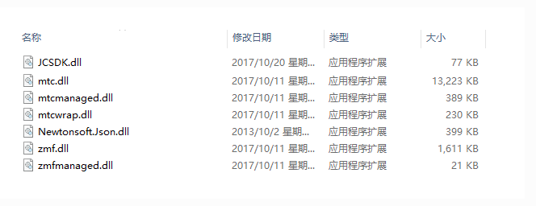
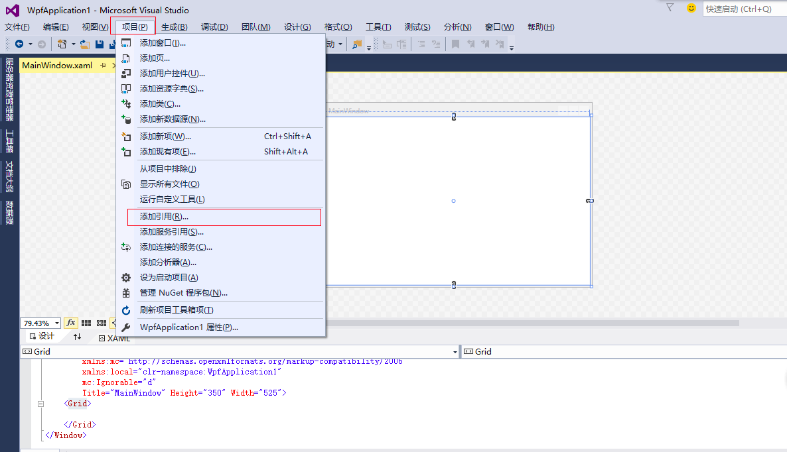
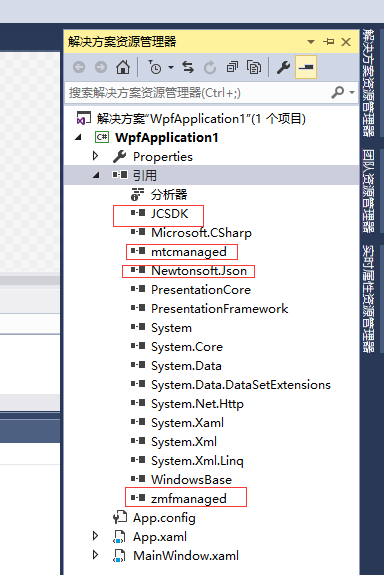
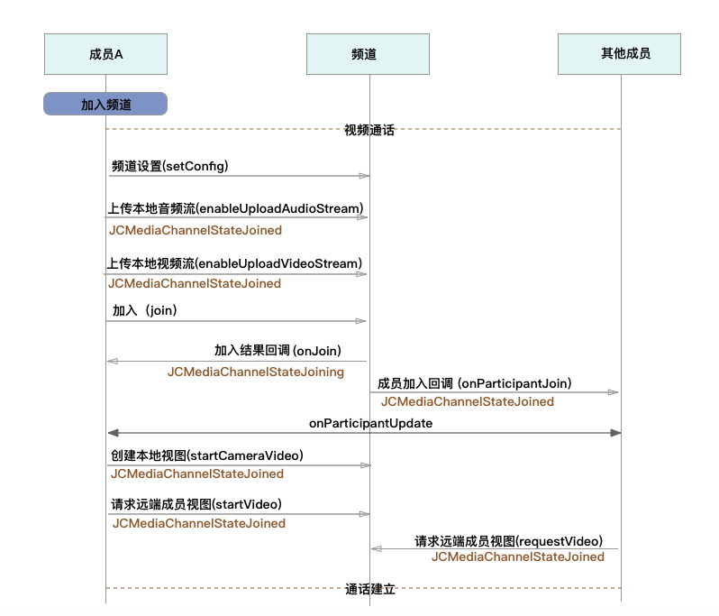

Windows
============================

.. _多方通话-windows:

.. highlight:: csharp

前提条件
----------------------------------

- Microsoft Visual Studio 2017 或以上版本

- 支持 Windows 7 或以上版本的 Windows 设备

- 有效的菊风开发者账号（`免费注册 <http://developer.juphoon.com/signup>`_ ）

准备工作
------------------------------

开始之前，请您先做好如下准备工作：

SDK 下载
>>>>>>>>>>>>>>>>>>>>>>>>>>>>>>>>>>

点击 `Windows SDK <http://developer.juphoon.com/document/cloud-communication-windows-sdk#2>`_ 进行下载。

AppKey 获取
>>>>>>>>>>>>>>>>>>>>>>>>>>>>>>>>>>

AppKey 是应用在 菊风云平台 中的唯一标识。需要在 SDK 初始化的时候使用，AppKey 获取请参考 :ref:`创建应用 <创建应用>` 。

SDK 配置
>>>>>>>>>>>>>>>>>>>>>>>>>>>>>>>>>>

.. _Windows SDK 配置:

准备工作：

1. 下载 Visual Studio 2013，请参考: `Visual Studio Downloads <https://www.visualstudio.com/en-us/downloads/download-visual-studio-vs.aspx>`_ 。

2. 安装 Directx End-User Runtime Web，请参考: `DirectX End-User Runtime Web <https://www.microsoft.com/zh-tw/download/details.aspx?id=35>`_ 。

.. note:: 菊风云平台 SDK Windows 版本（以下简称 SDK）支持 .net Framework 4.5及以上。

解压 SDK：

下载 Windows 版 SDK 并解压，解压后可以看到 bin 目录包含以下文件：

**导入Windows SDK**

1. 打开visual studio，新建WPF应用程序。

2. 点击“项目 > 添加引用”，将 bin 目录中的 JCSDK.dll，mtc.dll，mtcmanaged.dll，mtcwrap.dll，Newtonsoft.Json.dll，zmf.dll 和 zmfmanaged.dll 七个文件添加到您的工程目录中。

.. image:: images/windows_3_1.png

3. 在 Reference Manager 窗口中，可以看到添之后的文件，如下图：

4. 设置应用输出路径与库所在文件夹一致

.. image:: images/windows_5.png

5. 导入完成后编译运行，如果没有报错，恭喜您，您已经成功配置 SDK，可以进行 SDK 初始化了。

SDK 初始化
>>>>>>>>>>>>>>>>>>>>>>>>>>>>>>>>>>

.. _Windows SDK 初始化:

在使用 SDK 之前，都应该首先进行 SDK 的初始化。

.. highlight:: csharp

初始化 SDK，具体接口如下：

::

    /// 

    /// 创建 JCClient 实例
    /// 

    /// <param name="appKey">用户从 Juphoon Cloud 平台申请的 AppKey 字符串</param>
    /// <param name="callback">回调接口，用于接收 JCClient 相关通知</param>
    /// <param name="extraParams">额外参数，没有则填 null </param>
    /// <returns></returns>
    public static JCClient create(Application app, string appKey, JCClientCallback callback, Dictionary<string, string> extraParams)

.. note::

       appKey 为准备工作中“获取 AppKey”步骤中取得的 AppKey。如果还未获取 AppKey，请参考 :ref:`创建应用 <创建应用>` 来获取。

示例代码::

    public bool initialize(Application app)
    {
        // 初始化各模块，因为这些模块实例将被频繁使用，建议声明在单例中
        JCClient client = JCClient.create(app, "your appkey", this, null);
        return true;
    }

SDK 初始化之后，即可进行登录的集成。

登录
--------------------------------

.. _Windows 登录:

登录涉及 JCClient 类，其主要作用是负责登录、登出管理及帐号信息存储。

.. highlight:: c#

登录之前，可以通过配置关键字进行登录的相关配置，如是否使用代理服务器登录以及服务器地址的设置，具体如下：

登录环境设置
>>>>>>>>>>>>>>>>>>>>>>>>>>>>>>>>>>

服务器地址设置，包括国际环境服务器地址和国内环境服务器地址
::

    /// 

    /// 设置登录相关属性
    /// 

    /// <param name="key">设置的属性key值</param>
    /// <param name="value">设置的属性对应值</param>
    /// <returns>返回 ture 表示设置成功，false设置失败</returns>
    public bool setConfig(string key, string value)

其中，配置关键字有
::

    /// 服务器
    public const string JCClientConfigServer = "ConfigServer";
    /// 设备标识，用户可以自己传入设备标识
    public const string JCClientConfigDeviceId = "ConfigDeviceId";
    /// https代理, 例如 192.168.1.100:3128
    public const string JCClientConfigHttpsProxy = "ConfigHttpsProxy";

.. note::

    **国际环境** 服务器地址为 ``http:intl.router.justalkcloud.com:8080`` 。

    **国内环境** 服务器地址为 ``http:cn.router.justalkcloud.com:8080`` 。

示例代码::

    JJCClient client = JCClient.create(app, "your appkey", this, null);
    // 设置登录地址（国内环境）
    client.setConfig(JCClientConfigServer, "http:cn.router.justalkcloud.com:8080");
    // 设置登录地址（国际环境）
    client.setConfig(JCClientConfigServer, "http:intl.router.justalkcloud.com:8080");

设置登录相关参数后，可以调用下面的方法获取相关的配置
::

    /// 

    /// 获取设置属性的值
    /// 

    /// <param name="key">需要获取的属性key值</param>
    /// <returns>需要获取的属性值</returns>
    public string getConfig(string key)

示例代码::

    // 获取登录配置
    client.getConfig(JCClientConfigServer);

发起登录
>>>>>>>>>>>>>>>>>>>>>>>>>>>>>>>>>>

登录参数设置之后，即可调用 login 接口发起登录操作::

    /// 

    /// 登录 Juphoon Cloud 平台，只有登录成功后才能进行平台上的各种业务
    /// 登录结果通过 JCCallCallback 通知
    /// <param name="username">用户标识</param>
    /// <param name="password">密码，如果设置为免鉴权则可以填任意字符串</param>
    /// <returns>true 表示正常执行调用流程，false 表示调用异常</returns>
    /// <remarks>注意:用户名为英文数字和'+' '-' '_' '.'，长度不要超过64字符，'-' '_' '.'不能作为第一个字符</remarks>
    /// <remarks>当用户不存在时会自动创建该用户</remarks>
    public bool login(string username, string password)

结果返回 true 表示正常执行调用流程，false 表示调用异常。

.. note:: 用户名大小写不敏感，用户名为英文、数字和'+' '-' '_' '.'，长度不要超过64字符，'-' '_' '.'不能作为第一个字符。

示例代码::

    client.login(userId, password);

登录的结果通过 onLogin 回调接口上报::

    /// 

    /// 登录结果回调
    /// 

    /// <param name="result">true 表示登录成功，false 表示登录失败</param>
    /// <param name="reason">当 result 为 false 时该值有效，了解具体原因</param>
    void onLogin(bool result, JCClientReason reason);

其中，JCClientReason 有
::

        /// 

        /// 正常
        /// 

        None,
        /// 

        /// sdk 未初始化
        /// 

        SDKNotInit,
        /// 

        /// 无效参数
        /// 

        InvalidParam,
        /// 

        /// 函数调用失败
        /// 

        CallFucntionError,
        /// 

        /// 当前状态无法再次登录
        /// 

        StateCannotLogin,
        /// 

        /// 超时
        /// 

        TimeOut,
        /// 

        /// 网络异常
        /// 

        NetWork,
        /// 

        /// appkey 错误
        /// 
 
        AppKey,
        /// 

        /// 账号密码错误
        /// 

        Auth,
        /// 

        /// 无该用户
        /// 

        NoUser,
        /// 

        /// 强制登出
        /// 

        ServerLogout,
        /// 

        /// 其他错误
        /// 

        Other = 100,

登录成功之后，SDK 会自动保持与服务器的连接状态，直到用户主动调用登出接口，或者因为帐号在其他设备登录导致该设备登出。

登出
>>>>>>>>>>>>>>>>>>>>>>>>>>>>>>>>>>

登出调用下面的方法，登出后不能进行平台上的各种业务操作
::

    /// 

    /// 登出 Juphoon Cloud 平台
    /// 

    /// <returns>返回 true 表示正常执行调用流程，false 表示调用异常，异常错误通过 JCClientCallback 通知</returns>
    public bool logout();

登出结果通过 onLogout 回调接口上报::
    
    /// 

    /// 登出回调
    /// 

    /// <param name="reason">登出原因</param>
    void onLogout(JCClientReason reason);

当登录状态发生改变时，会收到 onClientStateChange 回调：
::

    /// 

    /// 登录状态变化通知
    /// 

    /// <param name="state">当前状态值</param>
    /// <param name="oldState">之前状态值</param>
    void onClientStateChange(JCClientState state, JCClientState oldState);

JCClientState 有::

    // 未初始化
    NotInit,
    // 未登录
    Idle,
    // 登录中
    Logining,
    // 登录成功
    Logined,
    // 登出中
    Logouting,

示例代码::

    private void onClientStateChange(JCClientState state, JCClientState oldState)
        {
            if (state == JCClientState.Idle) { // 未登录
               ...
            }
            else if (state == JCClientState.Logining) { // 登录中
               ...
            }
            else if (state == JCClientState.Logined) { // 登录成功
                ...
            }
            else if (state == JCClientState.Logouting) { // 登出中
                ...
            }
        }

完成以上步骤，就做好了基础工作，您可以开始集成业务了。

^^^^^^^^^^^^^^^^^^^^^^^^^^^^^^^^^^^^^^^^^

业务集成
------------------------------

**相关类说明**

多方视频通话涉及以下类：

.. list-table::
   :header-rows: 1

   * - 名称
     - 描述
   * - `JCMediaChannel <http://developer.juphoon.com/portal/reference/windows/html/8289e4bf-8045-497b-f584-fc76cad8f8a1.htm>`_
     - 媒体频道模块，类似音视频房间的概念，可以通过频道号加入此频道，从而进行音视频通话
   * - `JCMediaChannelParticipant <http://developer.juphoon.com/portal/reference/windows/html/8ad58616-3028-b8d3-8106-81b8b805c1ea.htm>`_
     - 媒体频道成员，主要用于成员基本信息以及状态等的管理
   * - `JCMediaChannelQueryInfo <http://developer.juphoon.com/portal/reference/windows/html/c933415b-17de-d9e6-ba4d-bbf14296e475.htm>`_
     - 媒体频道查询信息结果
   * - `JCMediaChannelCallback <http://developer.juphoon.com/portal/reference/windows/html/0526ed70-e26b-ad4c-e666-d356e0eb0448.htm>`_
     - 媒体频道回调代理
   * - `JCMediaDevice <http://developer.juphoon.com/portal/reference/windows/html/034d5af6-ec04-5148-7ec5-04e27e93e8c2.htm>`_
     - 设备模块，主要用于视频、音频设备的管理
   * - `JCMediaDeviceVideoCanvas <http://developer.juphoon.com/portal/reference/windows/html/6a5b853c-d890-c30e-d236-5728d789ace1.htm>`_
     - 视频对象，主要用于 UI 层视频显示、渲染的控制
   * - `JCMediaDeviceCallback <http://developer.juphoon.com/portal/reference/windows/html/3a00aa12-4e18-cf90-4610-b2c9c63b7a7b.htm>`_
     - 设备模块回调代理

更多关于类的详细信息请参考 `API 说明文档 <http://developer.juphoon.com/portal/reference/windows/html/c134a0d9-74d2-4872-28ed-5b62b207aa8c.htm>`_ 。

**开始集成多方通话功能前，请先进行** ``模块的初始化``

创建 JCMediaChannel 实例
::

    /// 

    /// 创建JCMediaChannel对象
    /// 

    /// <param name="client"> JCClient 对象</param>
    /// <param name="mediaDevice">JCMediaDevice 对象</param>
    /// <param name="callback">JCMediaChannelCallback 对象，用于接收JCMediaDevice通知</param>
    /// <returns>JCMediaChannel对象</returns>
    public static JCMediaChannel create(JCClient.JCClient client, JCMediaDevice.JCMediaDevice mediaDevice, JCMediaChannelCallback callback)

创建 JCMediaDevice 实例
::

        /// 

        /// 创建JCMediaDevice实例
        /// 

        /// <param name="client">JCClient实例</param>
        /// <param name="callback">JCMediaDeviceCallback回调函数，用于接收JCMediaDevice相关事件</param>
        /// <returns>JCMediaDevice实例</returns>
        public static JCMediaDevice create(JCClient.JCClient client, JCMediaDeviceCallback callback)

示例代码
::

    // 初始化各模块，因为这些模块实例将被频繁使用，建议声明在单例中        
    JCMediaDevice mediaDevice = JCMediaDevice.create(client, this);             
    JCMediaChannel mediaChannel = JCMediaChannel.create(client, mediaDevice, this);

**开始集成**

1. 加入频道
>>>>>>>>>>>>>>>>>>>>>>>>>>>>>>>>>>

频道设置
^^^^^^^^^^^^^^^^^^^^^^^^^^^^^^^^^^^^^^^^^

加入频道之前可以调用下面的接口进行频道设置，通过配置关键字对频道进行设置，如频道允许加入的最大人数，sip 呼叫配置。
::

    /// 

    /// 设置相关配置参数
    /// 

    /// <param name="key">参数关键字，见JCMediaChannelConstants</param>
    /// <param name="value">参数值</param>
    /// <returns>返回true表示设置成功，false表示设置失败</returns>
    public bool setConfig(string key, string value)

具体配置参数关键字如下

.. list-table::
   :header-rows: 1

   * - 名称
     - 描述
   * - JCMediaChannelConfigCapacity = "ConfigCapacity"
     - 设置频道人数
   * - JCMediaChannelConfigSipCallerNumber = "ConfigSipCallerNumber"
     - 设置 SIP呼叫 主叫号码
   * - JCMediaChannelConfigSipCoreNetwork = "ConfigSipCoreNetwork"
     - 设置 SIP呼叫 核心网ID

频道设置后，可以通过下面的接口获取获取相关配置参数
::

        /// 

        /// 获取相关配置参数
        /// 

        /// <param name="key">参数关键字，参见JCMediaChannelConstants</param>
        /// <returns>成功返回字符串类型具体值，失败返回null</returns>
        public string getConfig(string key)

发送本地音频流
^^^^^^^^^^^^^^^^^^^^^^^^^^^^^^^^^^^^^^^^^

在加入频道时，SDK 会 **自动打开音频设备**，因此可以在加入频道之前直接调用 enableUploadAudioStream 方法打开或关闭“上传音频”的标识，这样加入频道后其他成员就可以听到您的声音
::

    /// 

    /// 开启关闭发送本地音频流
    /// 1.在频道中将会与服务器进行交互，服务器会更新状态并同步给其他用户
    /// 2.未在频道中则标记是否上传音频流，在Join时生效
    /// 2.建议每次Join前设置
    /// 

    /// <param name="enable">开启关闭本地音频流</param>
    /// <returns>返回true表示调用成功，false表示调用失败</returns>
    public bool enableUploadAudioStream(bool enable)

.. note:: 

        在多方通话中，enableUploadAudioStream 的作用是设置“是否发送音频流数据”，此方法可以在加入频道前调用，也可以在加入频道后调用。
         - 如果在加入频道前调用，**只是打开或关闭“上传音频”的标识，但不会发送数据**，当加入频道成功时会根据 enableUploadAudioStream 设定的值来确定是否上传音频数据。同时，频道中的其他成员会收到该成员“是否上传音频“的状态变化回调（onParticipantUpdate）。
         - 如果在加入频道后调用，则会开启或者关闭发送本地音频流数据，服务器也会根据 enableUploadAudioStream 设定的值来确定是否上传音频数据。同时，频道中的其他成员会收到该成员“是否上传音频“的状态变化回调（onParticipantUpdate）。
        此外，此方法还可以实现开启或关闭静音的功能。当 enable 值为 false ，将会停止发送本地音频流，此时其他成员将听不到您的声音，从而实现静音功能

发送本地视频流
^^^^^^^^^^^^^^^^^^^^^^^^^^^^^^^^^^^^^^^^^

在加入频道前可以调用下面的方法打开或关闭“上传视频流”的标识，如果想看到视频画面，需要在加入频道后手动调用打开摄像头的接口
::

    /// 

    /// 开启关闭发送本地视频流
    /// 1.在频道中将会与服务器进行交互，服务器会更新状态并同步给其他用户
    /// 2.未在频道中则标记是否上传视频流，在Join时生效
    /// 2.建议每次Join前设置
    /// 

    /// <param name="enable">开启关闭本地视频流</param>
    /// <returns>返回true表示调用成功，false表示调用失败</returns>
    public bool enableUploadVideoStream(bool enable)

.. note:: 

    在多方通话中，enableUploadVideoStream 的作用是设置“是否上传视频流数据”，可以在加入频道前调用，也可以在加入频道后调用；
     - 如果在加入频道前调用，**只是打开或关闭“上传视频流”的标识，但不发送数据**，当加入频道后会根据 enableUploadVideoStream 设定的值来确定是否上传视频流数据。同时，频道中的其他成员会收到该成员”是否上传视频“的状态变化回调（onParticipantUpdate）。如果设定的值为 false，则在加入频道后自动开启语音通话模式。
     - 如果在加入频道后调用，则会开启或关闭发送本地视频流数据。服务器会根据 enableUploadVideoStream 设定的值来确定是否上传视频流数据。同时，频道中的其他成员会收到该成员”是否上传视频“的状态变化回调（onParticipantUpdate），从而进行语音通话和视频通话的切换。
    此外，调用该方法发送本地视频流数据还要依赖摄像头是否已经打开。

加入频道
^^^^^^^^^^^^^^^^^^^^^^^^^^^^^^^^^^^^^^^^^

接口如下，参数描述请看接口注释
::

    /// 

    /// 加入频道
    /// 

    /// <param name="channelIdOrUri">频道标识或频道Uri</param>
    /// <param name="joinParams">加入会议参数（设置cdn,录制,通道密码，最大分辨率，会议URI方式加入会议模式等）</param>
    /// <returns>返回true表示调用成功，false表示调用失败</returns>
    public bool join(string channelIdOrUri, Dictionary<string,string>joinParams)

.. note:: 加入频道会自动打开音频设备。

其中，joinParams 类型为字典，字典中的 key 值参考下面表格中的内容：

.. list-table::
   :header-rows: 1

   * - 名称
     - 描述
   * - JOIN_PARAM_CDN = "cdn"
     - CDN 地址参数
   * - JOIN_PARAM_RECORD = "record"
     - 音视频录制参数，包括"BucketName", "SecretKey","AccessKey"和"FileKey",参数值通过在七牛云注册获得
   * - JOIN_PARAM_PASSWORD = "password"
     - 频道密码
   * - JOIN_PARAM_MAX_RESOLUTION = "maxResolution"
     - 最大分辨率，参考 JCMediaChannelMaxResolution 枚举值，默认值为 JCMediaChannelMaxResolution360
   * - JOIN_SMOOTH_MODE= "smoothMode"
     - 设置平滑模式，确保弱网环境下视频流畅，默认值为 ''true'
   * - JOIN_PARAM_URI_MODE = "uriMode"
     - 是否以会议uri方式加入，值为 'true' 'false'，默认值为 'false'
   * - JOIN_PARAM_HEARTBEAT_TIME = "HeartbeatTime"
     - 心跳时长，单位为秒，指每隔多少时间发送心跳包，是会议终端和服务端keep alive的一种方式，定时向对端发送和回馈心跳包
   * - JOIN_PARAM_HEARTBEAT_TIMEOUT = "HeartbeatTimeout"
     - 心跳超时，指多少时间内没收到心跳包就超时（认为对方已离开）
   * - JOIN_PARAM_IS_SQUARE = "IsSquare"
     - true 表示正方形画面 false 表示 16:9画面，默认值为 'false'
   * - JOIN_PARAM_FRAME_RATE = "FrameRate"
     - 帧率 1-30, 默认 24
   * - JOIN_PARAM_MAX_BITRATE = "MaxBitrate"
     - 最大码率，默认2000
   * - JOIN_PARAM_CUSTOM_PROPERTY = "CustomProperty"
     - 自定义属性, json 格式字符串

其中： JCMediaChannelMaxResolution 枚举值有
::

        /// 

        /// 最大分辨率360P
        /// 

        MaxResolution360P,
        /// 

        /// 最大分辨率720P
        /// 

        MaxResolution720P,
        /// 

        /// 最大分辨率1080P
        /// 

        MaxResolution1080P

**示例代码**

::

    // 设置频道人数
    mediaChannel.setConfig(JCMediaChannelConstants.JCMediaChannelConfigCapacity, "6");
    Dictionary<string, string> joinparams = new Dictionary<string, string>();
    // 设置分辨率
    joinparams.Add(JCMediaChannelConstants.JOIN_PARAM_MAX_RESOLUTION, (int)JCMediaChannelMaxResolution.MaxResolution720P);
    // 发送本地音频流
    mediaChannel.enableUploadAudioStream(true);
    // 发送本地视频流
    mediaChannel.enableUploadVideoStream(true);
    // 加入频道
    mediaChannel.join("channelId", joinparams);

加入频道结果回调
::

    /// 

    /// 加入频道结果回调
    /// 

    /// <param name="result">true表示加入成功，false表示加入失败</param>
    /// <param name="reason">加入失败原因，在result为false时该值有效</param>
    /// <param name="channelId">媒体频道标识</param>
    void onJoin(bool result, JCMediaChannelReason reason, string channelId);

示例代码::

    // 加入频道结果回调
    public void onJoin(bool result, JCMediaChannelReason reason, string channelId)
    {
        if (result)
        {
            // 加入频道成功
        } else {
            // 加入频道失败
        }
    }

创建本地视频画面
^^^^^^^^^^^^^^^^^^^^^^^^^^^^^^^^^^^^^^^^^

- :ref:`创建本地视频画面<创建本地视频画面(windows)>`

加入频道后，如果想看到本地视频画面，需要打开摄像头以创建视频画面。

创建视频画面需要用到 :ref:`JCMediaDevice<JCMediaDevice(windows)>` 类和 :ref:`JCMediaDeviceVideoCanvas<JCMediaDeviceVideoCanvas(windows)>` 类。

进行视频渲染前可通过 :ref:`获取摄像头列表<获取摄像头列表(windows)>` 接口获取摄像头列表。

本地视频渲染调用 JCMediaDevice 类中的 :ref:`startCameraVideo<创建本地视频画面(windows)>` 接口，**该接口会打开摄像头**
::

    /// 

    /// 获取预览视频对象，通过此对象能获得视频用于UI显示
    /// 

    /// <param name="camera">摄像头对象</param>
    /// <param name="mode">渲染方式</param>
    /// <returns>JCMediaDeviceVideoCanvas对象</returns>
    public JCMediaDeviceVideoCanvas startCameraVideo(JCMediaDeviceCamera camera, JCMediaDeviceRenderMode mode)

其中，渲染模式（JCMediaDeviceRenderMode）有以下几种::

        /// 

        /// 铺满窗口
        /// 

        FULLSCREEN,
        /// 

        /// 全图像显示，会有黑边
        /// 

        FULLCONTENT,
        /// 

        /// 自适应
        /// 

        AUTO

.. note:: 调用该方法后，在挂断通话或者关闭摄像头时需要对应调用 stopVideo 方法停止视频。

示例代码::

    // 获取摄像头列表
    List<JCMediaDeviceCamera> cameraDevices = mediaDevice.cameraDevices;
    // 创建本地视频画面对象
    JCMediaDeviceVideoCanvas localCanvas = mediaDevice.startCameraVideo(cameraDevices[0], JCMediaDevice.JCMediaDeviceRenderMode.FULLCONTENT);  
    ImageBrush image = new ImageBrush(localCanvas.videoView);
    image.Stretch = Stretch.Uniform;
    this.label.Background = image;

该方法采集分辨率默认值为 640*360，帧率为 30，画面与窗口旋转角度为 0。

如果想自定义摄像头采集参数，如采集的高度、宽度和帧速率，需要在调用 startCameraVideo 接口前调用下面的接口
::

        /// 

        /// 设定摄像头分辨率，请在调用startCamera()接口之前调用才会生效
        /// 

        /// <param name="width">摄像头分辨率宽</param>
        /// <param name="height">摄像头分辨率高</param>
        /// <param name="framerate">帧速率</param>
        public void setCameraProperty(int width, int height, int framerate)

如果想指定开启某个摄像头，需要在调用 startCameraVideo 接口前获取摄像头列表，然后再指定开启其中的某个摄像头。
::

        /// 

        /// 摄像头列表
        /// 

        public List<JCMediaDeviceCamera> cameraDevices

其中，JCMediaDeviceCamera 有以下几个变量
::

    /// 

    /// 摄像头
    /// 

    public class JCMediaDeviceCamera {
        /// 

        /// 摄像头名称
        /// 

        public string cameraName;
        /// 

        /// 摄像头id
        /// 

        public string cameraId;
    }

如果想设置Canvas中画布的角度，需要调用 JCMediaDeviceVideoCanvas 类中的 rotate 接口
::

        /// 

        /// 旋转画面
        /// 

        /// <param name="angle">旋转角度</param>
        public void rotate(JCMediaDeviceVideoCanvasRoatate angle)

其中，角度需为 90 的倍数。调用该接口后，本端显示的本地视频画面和远端视频画面会同时旋转相同的角度，而对端显示的画面不受影响。

例如 A 设置旋转 90 度，则 A 端显示的 A 和 B 视频画面会同时旋转 90 度。而 B 端的视频画面则不会发生任何改变。如下图所示：

.. image:: images/rotateset.png

JCMediaDeviceVideoCanvasRoatate 枚举值如下
::

        /// 

        /// 0
        /// 

        Angle0 = 0,
        /// 

        /// 90
        /// 

        Angle90 = 90,
        /// 

        /// 180
        /// 

        Angle180 = 180,
        /// 

        /// 270
        /// 

        Angle270 = 270

创建远端视频画面
^^^^^^^^^^^^^^^^^^^^^^^^^^^^^^^^^^^^^^^^^

- :ref:`创建远端视频画面<创建远端视频画面(windows)>`

加入频道后，如果想看到其他成员的视频画面，需要创建远端视频画面，具体如下：

- 远端视频渲染

远端渲染调用 :ref:`startVideo<创建远端视频画面(windows)>` 获取视频对象
::

    /// 

    /// 获得视频对象，通过此对象能获得视频用于UI显示
    /// 

    /// <param name="videoSource">渲染标识串，比如JCMediaChannelParticipant JCCallItem中的renderId</param>
    /// <param name="mode">渲染模式</param>
    /// <returns>JCMediaDeviceVideoCanvas对象</returns>
    public JCMediaDeviceVideoCanvas startVideo(string videoSource, JCMediaDeviceRenderMode mode)

其中，渲染模式（JCMediaDeviceRender)请参考 :ref:`渲染模式<渲染模式(windows)>`。

.. note:: 调用该方法后，在挂断通话或者关闭摄像头时需要对应调用 stopVideo 方法停止视频。

- 请求远端成员视频流

由于服务器默认是不转发视频数据的，所以如果想看到远端成员画面需要调用 requestVideo 接口请求远端成员的视频流
::
   
    /// 

    /// 请求频道中的其他用户视频流
    /// 当pictureSize为None表示关闭请求
    /// 

    /// <param name="participant">用户对象</param>
    /// <param name="pictureSize">视频请求尺寸类型</param>
    /// <returns>返回true表示调用成功，false表示调用失败</returns>
    public bool requestVideo(JCMediaChannelParticipant participant, JCMediaChannelPictureSize pictureSize)

其中，视频尺寸（JCMediaChannelPictureSize）有以下几种：

.. list-table::
   :header-rows: 1

   * - 名称
     - 描述
   * - None
     - 不请求
   * - Min
     - 最小尺寸，160x90
   * - Small
     - 小尺寸，320x180，小窗口模式下可以使用小尺
   * - Large
     - 大尺寸，640x360
   * - Max
     - 最大尺寸，360P 的会议为 640x360 ，720P 的会议为 1280x720

.. note:: 您可以根据相应的窗口大小使用相应的视频尺寸，避免造成不必要的流量浪费和额外的功耗。比如窗口的大小是 160x90，则应该使用 JCMediaChannelPictureSizeMin。

现在您可以开始多方视频通话了。

示例代码::

    // 成员加入回调
    public void onParticipantJoin(JCMediaChannelParticipant participant) {
        // 创建远端视频画面对象，renderId来源JCMediaChannelParticipant对象
        List<JCMediaChannelParticipant> partps = mediaChannel.getParticipants();
        JCMediaChannelParticipant item = partps.get(0);
        String renderId = item.renderId;
        JCMediaDeviceVideoCanvas remoteCanvas = mediaDevice.startVideo(renderId, JCMediaDevice.JCMediaDeviceRenderMode.FULLSCREEN);
        ImageBrush image = new ImageBrush(remoteCanvas.videoView);
        image.Stretch = Stretch.Uniform;
        this.label.Background = image;
        // 请求远端视频流，participant为JCMediaChannelParticipant对象
        mediaChannel.requestVideo(participant, JCMediaChannelPictureSize.Large);
    }

^^^^^^^^^^^^^^^^^^^^^^^^^^^^^^^^^^^^^^^^^^

2. 离开频道
>>>>>>>>>>>>>>>>>>>>>>>>>>>>>>>>>>

.. image:: leavechannel.png

如果想离开频道，可以调用下面的接口
::

    /// 

    /// 离开频道
    /// 

    /// <returns>返回true表示调用成功，false表示调用失败</returns>
    public bool leave()

示例代码::

    // 离开频道
    mediaChannel.leave();

在多方视频通话中，在离开频道后还需要调用 JCMediaDevice 类中的 :ref:`stopVideo<销毁本地和远端视频画面(windows)>` 接口移除视频画面
::

    /// 

    /// 停止视频
    /// 

    /// <param name="canvas">JCMediaDeviceVideoCanvas对象，由startVideo获得</param>
    public void stopVideo(JCMediaDeviceVideoCanvas canvas)

离开频道后，UI 会收到 onLeave 回调，该回调返回离开原因以及频道标识符
::

    /// 

    /// 离开频道结果标识
    /// 

    /// <param name="reason">离开原因</param>
    /// <param name="channelId">媒体频道标识</param>
    void onLeave(JCMediaChannelReason reason, string channelId);

离开原因枚举值请参考 `JCMediaChannelReason <http://developer.juphoon.com/portal/reference/windows/html/4481d778-9d4d-43fe-f94d-fdfa690dd939.htm>`_。

示例代码::

    public void onLeave(JCMediaChannelReason reason, string channelId)
    {
        // 停止视频
        // 销毁canvas
    }

3. 解散频道
>>>>>>>>>>>>>>>>>>>>>>>>>>>>>>>>>>

.. image:: stopchannel.png

如果想解散频道，可以调用下面的接口，此时所有成员都将被退出
::

    /// 

    /// 结束频道，所有成员都将被退出
    /// 

    /// <returns>返回true表示调用成功，false表示调用失败</returns>
    public bool stop()

示例代码::

    // 结束频道
    mediaChannel.stop();

关闭频道的结果通过 onStop 回调
::

    /// 

    /// 解散频道结果回调
    /// 

    /// <param name="result">true 表示成功，false 表示失败</param>
    /// <param name="reason">解散失败原因，当 result 为 false 时该值有效</param>
    void onStop(bool result, JCMediaChannelReason reason);

解散失败原因枚举值请参考 `JCMediaChannelReason <http://developer.juphoon.com/portal/reference/windows/html/4481d778-9d4d-43fe-f94d-fdfa690dd939.htm>`_。

示例代码::

    public void onStop(bool result, JCMediaChannelReason reason)
    {
        // 停止视频
        // 销毁canvas
    }

Sample 代码
>>>>>>>>>>>>>>>>>>>>>>>>>>>>>>>>>>>>>>>>>>>>

**关键代码实现：**

1.初始化 JC SDK 以及频道和媒体设备模块

::

    public void initialize() 
    {
        // AppKey为创建应用获取的AppKey
        JCClient client = JCClient.create(app ,"AppKey", this, null);
        JCMediaDevice mediaDevice = JCMediaDevice.create(client, this);
        JCMediaChannel mediaChannel = JCMediaChannel.create(client, mediaDevice, this);
    }

2.登录

::

    public void login()
    {
        client.login("用户名", "密码");
    }

3.频道设置

::

    // 设置会议人数，如果不设置，则默认为6人
    mediaChannel.setConfig(JCMediaChannelConstants.JCMediaChannelConfigCapacity, "6");

4.发送本地音视频流

::

    // 发送本地音频流
    mediaChannel.enableUploadAudioStream(true);
    // 发送本地视频流
    mediaChannel.enableUploadVideoStream(true);

5.加入频道

::

    // 加入频道
    mediaChannel.join("频道id", null);

6.本地视图渲染

::

    public void setLocalCanvas()
    {
        // 创建本地视频画面对象
        JCMediaDeviceVideoCanvas localCanvas = mediaDevice.startCameraVideo(cameraDevices[0], JCMediaDevice.JCMediaDeviceRenderMode.FULLCONTENT);
    }

7.远端视图渲染

::

    // 成员加入回调
    public void onParticipantJoin(JCMediaChannelParticipant participant) {
        // 创建远端视频画面对象，renderId来源JCMediaChannelParticipant对象
        JCMediaDeviceVideoCanvas remoteCanvas = mediaDevice.startVideo(renderId, JCMediaDevice.JCMediaDeviceRenderMode.FULLSCREEN);
        // 请求远端视频流，participant为JCMediaChannelParticipant对象
        mediaChannel.requestVideo(participant, JCMediaChannelPictureSize.Large);
    }

8.离开频道

::

    // 离开频道
    mediaChannel.leave();
    // canvas为JCMediaDeviceVideoCanvas对象
    mediaDevice.stopVideo(canvas);

9.解散频道

::

    mediaChannel.stop();

**更多功能**

- :ref:`通话状态更新<通话状态更新(Windows)>`

- :ref:`通话过程控制<通话过程控制(Windows)>`

- :ref:`视频设备管理<视频设备管理(Windows)>`

- :ref:`音频设备管理<设备控制(Windows)>`

**进阶**

在实现音视频通话的过程中，您可能还需要添加以下功能来增强您的应用：

- :ref:`查询频道<查询频道(windows)>`
- :ref:`桌面或窗口共享<屏幕共享(windows)>`
- :ref:`CDN 推流<CDN 推流(windows)>`
- :ref:`音视频录制<音视频录制(windows)>`
- :ref:`发送消息<发送消息(windows)>`
